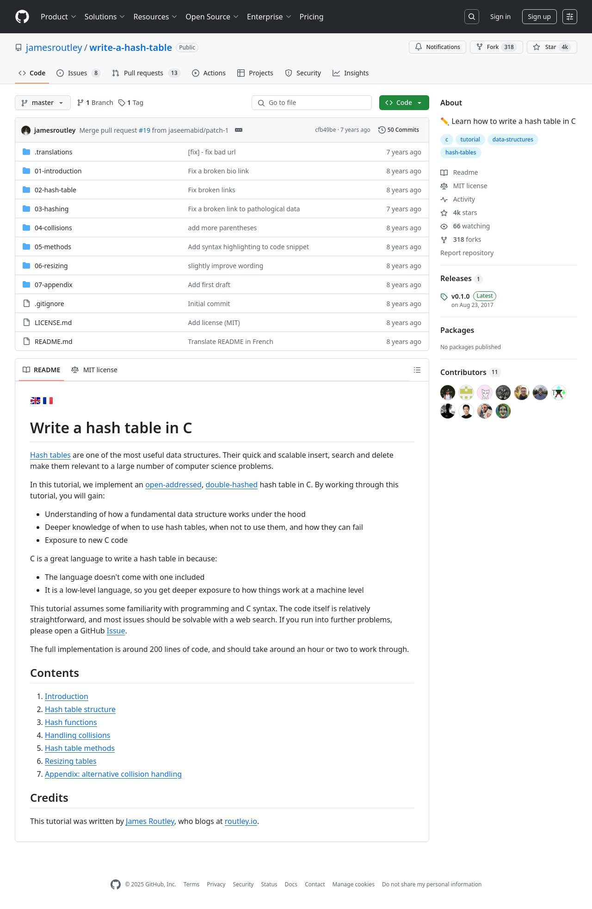
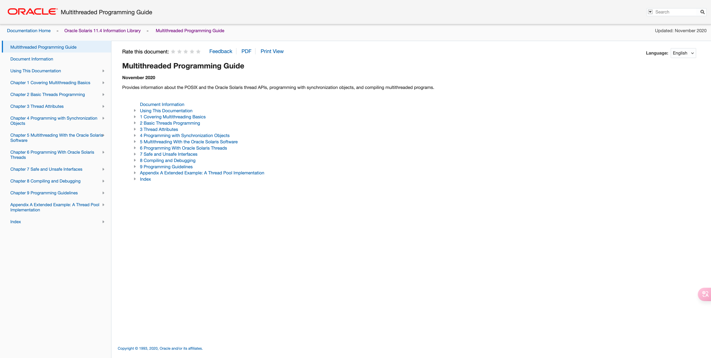
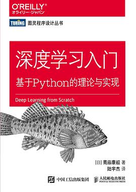
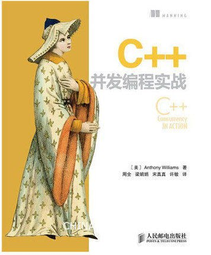
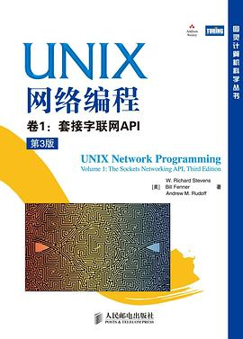
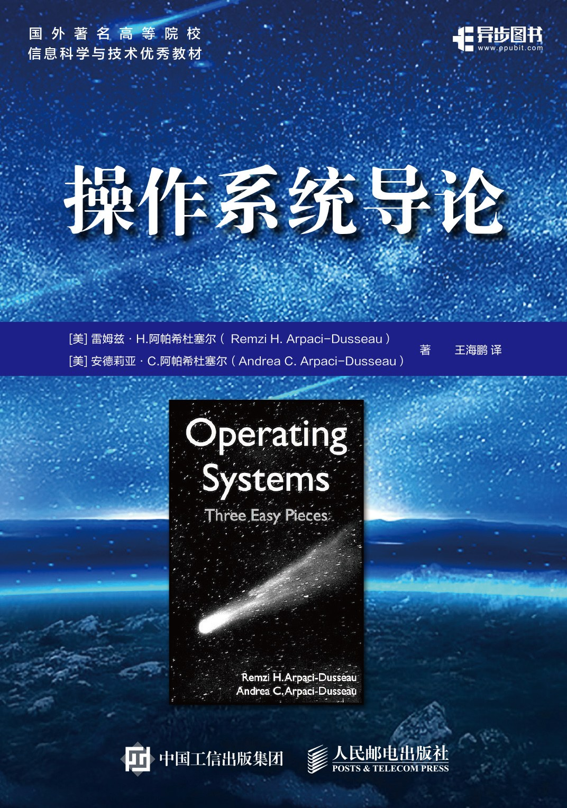
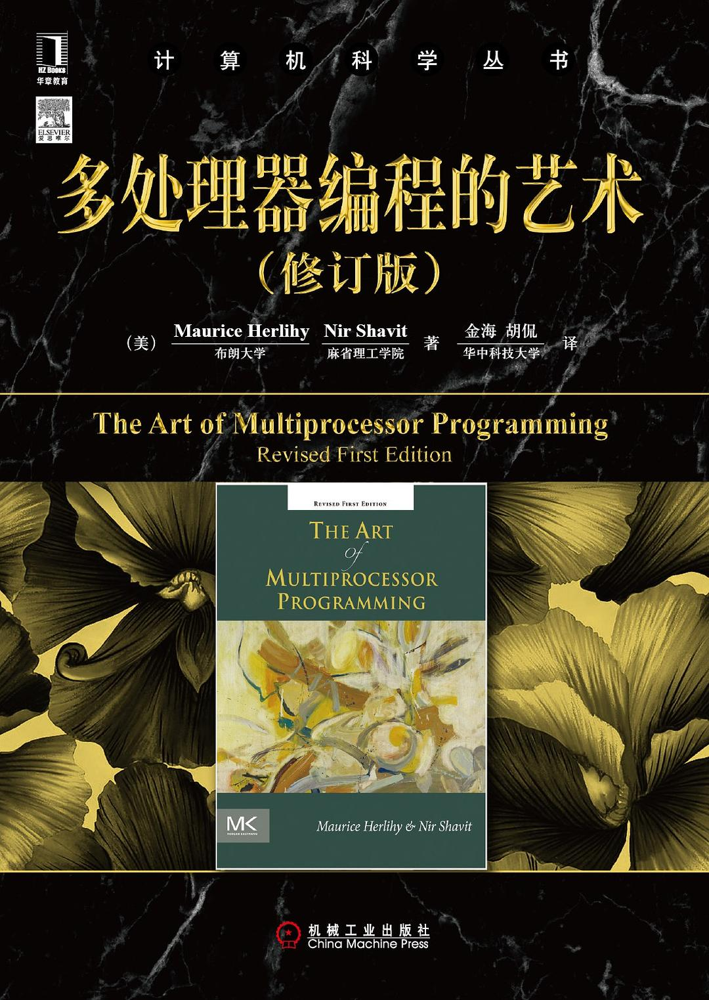
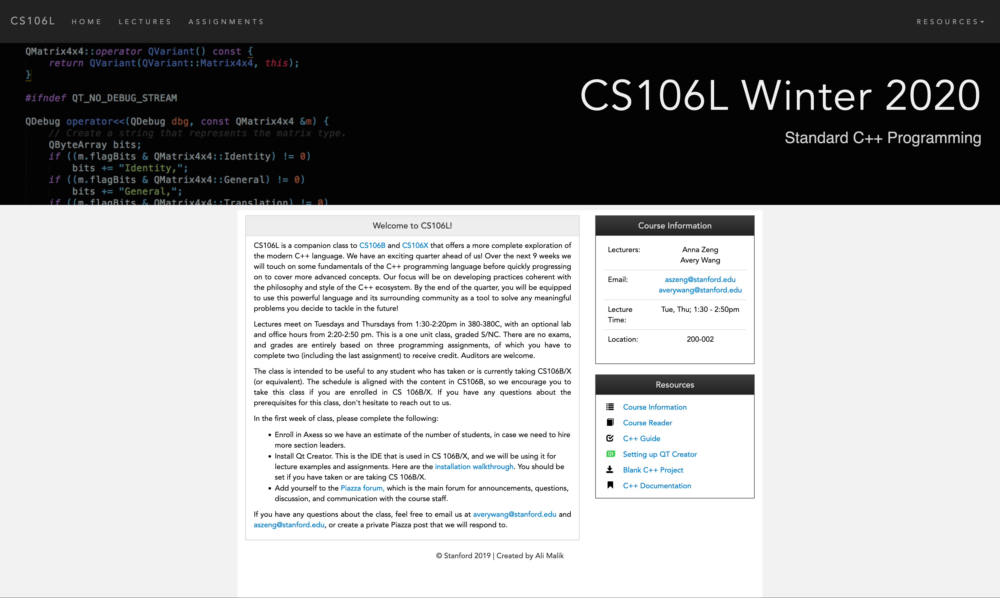

# 阅读笔记

## 索引

笔记 | 封面 | 类型 | 分类 | 年度
--- | ---  | --- | --- | ---
[从零开始写一个哈希表](./write-a-hash-table/) |  | 教程 | 计算机 | 2025
[多线程编程指南](./multithreaded-programming-guide/) |  | 书籍 | 计算机 | 2025
[深度学习入门](./deep-learning-from-scratch/) |  | 书籍 | 计算机 | 2024 
[C++并发编程实战（第一版）](./cpp-concurrency-in-action/) |  | 书籍 | 计算机 | 2024
[UNIX网络编程 卷1：套接字联网API](./unp-v1/) |  { width="150" } | 书籍 | 计算机 | 2024
[操作系统导论](./ostep/) |  { width="150" } | 书籍 | 计算机 | 2024
[遥远的救世主](./the-distant-savior/) |  { width="150" } | 书籍 | 小说 | 2024
[多处理器编程的艺术(修订版)](./the-art-of-multiprocessor-programming/) |   { width="150" } | 书籍 |  计算机 | 2024
[深度探索Go语言对象模型与runtime的原理、特性及应用](./goruntime/) |  { width="150" }  | 书籍 |  计算机 | 2024
[【斯坦福】cs106L:C++标准库编程(2020)](./cs106L/) |  { width="150" }  | 公开课 |  计算机 | 2024
[x86汇编语言（第2版）：从实模式到保护模式](./x86-assembly-language/) |  { width="150" }  | 书籍 |  计算机 | 2023