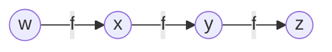

# Applied Deep Learning 2024

## 课程说明

- **课程名称**：深度学习之应用2024版(Applied Deep Learning 2024)
- **公开课组织**：台湾大学资讯工程系
- **官网地址**：https://www.csie.ntu.edu.tw/~miulab/f113-adl/
- Youtube地址：https://www.youtube.com/playlist?list=PLOAQYZPRn2V6kQfY453CIakozNGR_gQdA
- 课程PPT:
	- [Course Logistics](https://note.cyub.vip/slides/adl2024/240904_Course.pdf)
	- [Introduction](https://note.cyub.vip/slides/adl2024/240904_Introduction.pdf)
	- [**实践**：Dev Infra & Tooling](https://colab.research.google.com/drive/1yoyDg3411OyddX5fPGomtGe3_0Kz77qT?usp=drive_link)
	- [Neural Network Basics](https://note.cyub.vip/slides/adl2024/240904_NNBasics.pdf)
	- [Backpropagation for Optimization](https://note.cyub.vip/slides/adl2024/240904_Backprop.pdf)
	- [Sequence Modeling:Language Modeling & Recurrent Neural Networks](https://note.cyub.vip/slides/adl2024/240911_SeqModel.pdf)
	- [Attention Mechanism](https://note.cyub.vip/slides/adl2024/240911_Attention.pdf)
	- [**实践**： NLPer的一生](https://note.cyub.vip/slides/adl2024/w2-ProjLife.pdf)
	- [Word Embeddings](https://note.cyub.vip/slides/adl2024/220929_WordEmbeddings.pdf)
	- [Transformer](https://note.cyub.vip/slides/adl2024/240911_Transformer.pdf)
	- [Tokenization](https://note.cyub.vip/slides/adl2024/240918_Tokenization.pdf)
	- [BERT:Bidirectional Encoder Representations from Transformers](https://note.cyub.vip/slides/adl2024/240918_BERT.pdf)
	- [BERT Variants](https://note.cyub.vip/slides/adl2024/240918_BERTVariants.pdf)
	- [**实践**: NLPer的底层逻辑](https://note.cyub.vip/slides/adl2024/w3-UnderlyLogic.pdf)
	- [NLG Decoding](https://note.cyub.vip/slides/adl2024/240925_NLG.pdf)
	- [Prompt-Based Learning](https://note.cyub.vip/slides/adl2024/241009_PromptLearning.pdf)
	- [**实践**：Large Language Model Basics and MoE Architecture](https://note.cyub.vip/slides/adl2024/w4-LLMBasicsMOE.pdf)
	- [LLM Adaptation](https://note.cyub.vip/slides/adl2024/241016_Adaptation.pdf)
	- [**实践**：Large Language Model Lora Training](https://note.cyub.vip/slides/adl2024/w5-LoRA.pdf)
	- [Conversational Modeling](https://note.cyub.vip/slides/adl2024/241030_ConvAI.pdf)
	- [Retrieval-Augmented Generation (RAG)](https://note.cyub.vip/slides/adl2024/241120_RAG.pdf)
	- [Beyond Supervised Learning](https://note.cyub.vip/slides/adl2024/241127_BeyondSL.pdf)
	- [**实践**：Large Language Model Inference and Eval](https://note.cyub.vip/slides/adl2024/w6-LLMInferenceEval.pdf)
	- [Language Agents](https://note.cyub.vip/slides/adl2024/241204_LangAgent.pdf)
	- [Issues and Development in PLMs: Fairness, Safety, Alignment, Factuality, Multimodality](https://note.cyub.vip/slides/adl2024/241211_Issues.pdf)

## Backpropagation 效率地计算大量参数

### 符号说明

| 符号         | 含义                                              | 说明                                                 |
| ---------- | ----------------------------------------------- | -------------------------------------------------- |
| $a_i^l$    | output of a neuron                              | 第$l$层第$i$个神经元的激活输出，是经过激活函数之后的输出，a是激活actviation的首字母 |
| $a^l$      | output vector of a layer                        | 第$l$层所有神经元的输出组成的向量                                 |
| $z_i^l$    | input of activation functiion                   | 第$l$层第$i$个神经元的加权输入（又叫 pre-activation），作为激活函数的输入    |
| $z^l$      | input vector of activation function for a layer | 第$l$层所有神经元的加权值                                     |
| $w_{ij}^l$ | a weight                                        | 第$l-i$层的第$j$个神经元到第$l$层$i$个神经元的权重                   |
| $w^l$      | a weight matrix                                 | 第$l$层的权重矩阵                                         |
| $b_i^l$    | a bias                                          | 第$l$层第$i$的神经元的偏置                                   |
| $b^l$      | a bias vector                                   | 第$l$层所有神经元组成的向量                                    |

### 神经元输出

下图是从第$l-1$层的$a$到第$l$层$z$的关系，其中$l-1$层有$N_{l-1}$个节点(node)，第$l$层有$n_l$个节点：

如果将上面得到$z$放入到激活函数中将会得到从$z$到$a$的结果：

上面两个输出整合在一起，构成第$l$层神经元输出：

### 神经网络表达式

$$
\begin{aligned}
& a^1 = \sigma(W^1x + b^1)\\
& a^2 = \sigma(W^2a^1 + b^2)\\
& \cdots\\
&y = a^L = \sigma(W^La^{L-1}  + b^L)\\
\end{aligned}
$$

从上面关系可以看出$a^1$可以计算出$a^2$，最终计算出$a^L$.按照这个顺序依次带入公式中，我们可以得到：

$$
\mathbf{y} = f(\mathbf{x}) = \sigma(W^L\cdots\sigma(W^2\sigma(W^1\mathbf{x} + b^1) + b^2)\cdots + b^L)
$$

上面公式中$\mathbf{x}$是输入向量，$\mathbf{y}$是输出向量。

### 损失函数

评估一个拟合函数的好坏，应该是函数预测值极大地近似真实值，即：

$$
f(x;\theta) \sim \hat{y}
$$

其中：
- $\hat{y}$是真实值，注意MSE中$\hat{y}$一般表示的是预测值
- $f(x;\theta)$ 表示拟合参数为$\theta$时的预测函数，若是神经网络输出，表示的**输入为 x**、**网络权重和偏置为 θ** 时的预测函数。

将上面表达式转换成数学公式：

$$
\|\hat{y} - f(x;\theta)\|  \approx 0
$$

从而我们可以定一个损失函数：

$$
C(\theta) = \sum_{k}\|\hat{y}_k - f(x_k;\theta)\|
$$

### 神经网络的梯度下降法

$$
\mathbf{y} = f(\mathbf{x}) = \sigma(W^L\cdots\sigma(W^2\sigma(W^1\mathbf{x} + b^1) + b^2)\cdots + b^L)
$$

$$
\theta = \{W^1, b^1, W^2, b^2, \cdots,W^L, b^L\}
$$

$$
W^l = \begin{bmatrix} w_{11}^l & w_{12}^l & \cdots  \\ w_{21}^l & w_{22}^l & \cdots \\ \vdots & \vdots & \ddots &  \\ w_{{N_l}1}^l & w_{{N_l}2}^l & \cdots  \\ \end{bmatrix}\quad
b^l = \begin{bmatrix}  \vdots \\ b_{i}^l  \\ \vdots \end{bmatrix}\quad(第i层有N_i个节点)
$$

$$
\nabla C(\theta) = \begin{bmatrix}  \vdots \\ \frac{\partial C(\theta)}{\partial w_{ij}^l}  \\ \vdots \\ \frac{\partial C(\theta)}{\partial b_i^j} \end{bmatrix}
$$

#### 链式法则

考虑上面的神经网络网络，$w$神经元的微小变动$\Delta w$，经过激活函数$f$后，会影响$x$神经元的输入(带来了变动$\Delta x$)，依次传递，最终影响$z$的结果。这个变动带来级联反应可以如下表示：

$$
\Delta w \to \Delta x \to \Delta y \to \Delta z
$$

这个其实就是链式法则。我们可以$w$想象成带有旋钮的机器，我们调整旋钮时候可以改变$w$的输出，当我们扭动旋钮时候，$w$机器输出变化了$\Delta w$，依次...,具体描述参见[[链式法则#如何理解链式法则？]]

让我们来计算$z$关于$w$的偏微分，根据链式法则有：

$$
\begin{aligned}
\frac{\partial z}{\partial w} 
&= \frac{\partial z}{\partial y}\frac{\partial y}{\partial x}\frac{\partial x}{\partial w}\\\\
&= f'(y)f'(x)f'(w)\\\\
&= f'(f(f(w)))f'(f(w))f'(w)
\end{aligned}
$$

当我们计算$z$关于$w$的偏微分时候，可以看到我们先计算出$z$关于$y$的偏微分，再接着计算出$y$关于$x$的偏移$\cdots$,最后得出结果。这个计算过程跟变量输入传递过程相反，这就是反向传播（back propagation)。

#### 损失函数关于某个权重的偏导

让我们来计算损失函数$C(\theta)$关于第$l-1$层第$j$个神经元到第$l$层第$i$个神经元的权重$w_{ij}^l$的偏导。由于难以直接计算出这个偏导，但考虑到$w_{ij}^l$变动会影响$z_i^l$的变动，根据上面介绍的链式法则，我们得出下面公式：

$$
\frac{\partial(\theta)}{\partial w_{ij}^l} = \frac{\partial C(\theta)}{\partial z_i^l}{\frac{\partial z_i^l}{\partial w_{ij}^l}}
$$

##### z对w的偏微分

接下来我们先来计算$z$对$w$的偏微分$\frac{\partial z_i^l}{\partial w_{ij}^l}$，先考虑$l>1$（即上一层$l-i$不是输入层）的情况：

$$
\begin{aligned}
&Z^l = W^lA^{l-i} + B^l \quad{（此时为向量形式，用大写符号表示更直观)}\\ 
&\Downarrow \\
& z_i^l = \sum_jw_{ij}^laj^{l-1} + b_i^j\\
&\Downarrow \\
&\frac{\partial z_i^l}{\partial w_{ij}^l} = a_j^{l-1}
\end{aligned}
$$

接下来考虑$l=1$时情况，此时$l-1$层是输入层：

那么最终$z$对$w$的偏微分：

$$
\frac{\partial z_i^l}{\partial w_{ij}^l} = 
\begin{cases}
a_j^{l-1}, \quad l > 1 \\
x_j, \quad l = 1
\end{cases}
$$

##### 计算误差项$\delta i$

$$
\frac{\partial(\theta)}{\partial w_{ij}^l} = \boxed{\frac{\partial C(\theta)}{\partial z_i^l}}{\frac{\partial z_i^l}{\partial w_{ij}^l}}
$$

接下来我们计算剩余的$\frac{\partial C(\theta)}{\partial z_i^l}$,这里我们引入符号$\delta i^l$来表示这个偏微分，也就是说它表示的是损失函数$C(\theta)$对第$l$层第$i$层神经元的加权输入$z_i^l$的偏微分,也叫做误差项。

$$
\delta i^l = \frac{\partial C(\theta)}{\partial z_i^l}
$$

计算$\delta ^l$($\delta ^l$是第$l$所有误差项组成的向量，包含$\delta_i^l$)时，我们可以从$\delta^L$到$\delta^l$,一层一层的反方向计算出来,这样计算更高效。

计算思路：

1. 先计算$\delta^L$。

计算$\delta^L$：

由于：

$$
\delta_i^L = \frac{\partial C}{\partial z_i^L}\quad \quad \Delta z_i^L \to \Delta a_i^L = \Delta y_i \to \Delta C 
$$

所以：

$$
\begin{aligned}
&\delta_i^L = \frac{\partial C}{\partial z_i^L} \\
&= \frac{\partial C}{\partial y_i}\frac{\partial y_i}{\partial z_i^l} \quad{(依据上面的链式法则)}\\
&= \boxed{\frac{\partial C}{\partial y_i}}\frac{\partial y_i}{\partial z_i^l} \quad{(圈中部分依赖损失函数定义)}\\
&= \frac{\partial C}{\partial y_i}\frac{\partial \boxed{y_i = a_i^L = \sigma(z_i^L)}} {\partial z_i^l}\\
&= \frac{\partial C}{\partial y_i}\sigma'(z_i^L)\\
&=\Delta C(y)\sigma'(z_i^L)
\end{aligned}
$$

上面是单个误差项，整个$L$的误差项是：

$$
\delta ^L = \sigma'(z^L)\odot \nabla C(y)
$$

现在基于$\delta^{l+1}$来计算$\delta ^l$:

考虑到$z_i^l$的微小变化会影响$a_i^l$，而$a_i^l$会影响第$l+1$层的$z$,进而影响$l+1$的$a$，进而影响第$l+2$层，依次下去最终影响到$C$。依赖传递关系如下：

$$
\Delta z_i^l \to \Delta a_i^l \to Z^{l+1} \to A^{l+1} \to \cdots \to \Delta C\quad{(Z、A是向量)}
$$

$$
\begin{aligned}
\delta i^l &= \frac{\partial C(\theta)}{\partial z_i^l} \\
&=\sum_k(\frac{\partial C}{\partial z_k^{l+1}}\frac{\partial z_k^{l+1}}{\partial a_i^l}\frac{\partial a_i^l}{\partial z_i^l})\\
&= \frac{\partial a_i^l}{\partial z_i^l}\sum_k (\frac{\partial C}{\partial z_k^{l+1}}\frac{\partial z_k^{l+1}}{\partial a_i^l}) \quad{(提取出与k无关的公共部分)}\\
&= \frac{\partial a_i^l}{\partial z_i^l}\sum_k (\boxed{\frac{\partial C}{\partial z_k^{l+1}}}\frac{\partial z_k^{l+1}}{\partial a_i^l}) \quad{(\frac{\partial C}{\partial z_k^{l+1}} 即为\delta_k^{l+1})}\\
&= \frac{\partial a_i^l}{\partial z_i^l}\sum_k (\frac{\partial z_k^{l+1}}{\partial a_i^l}\delta_k^{l+1}) \\
&= \boxed{\frac{\partial a_i^l}{\partial z_i^l} = \frac{\partial \sigma(z_i^l)}{\partial z_i^l}}\sum_k (\frac{\partial z_k^{l+1}}{\partial a_i^l}\delta_k^{l+1}) \\
&= \sigma'(z_i)\sum_k (\frac{\partial z_k^{l+1}}{\partial a_i^l}\delta_k^{l+1}) \\
&= \sigma'(z_i)\sum_k (\frac{\partial \boxed{z_k^{l+1} = \sum_i{w_{ki}^{l+1}a_i^l + b_k^{l+1}}}}{\partial a_i^l}\delta_k^{l+1}) \\
&= \sigma'(z_i)\sum_k (\frac{\partial \boxed{z_k^{l+1} = \sum_i{w_{ki}^{l+1}a_i^l + b_k^{l+1}}}}{\partial a_i^l}\delta_k^{l+1}) \\
&= \sigma'(z_i)\sum_k (w_{ki}^{l+1}\delta_k^{l+1}) 
\end{aligned}
$$

最终我们得到：

$$
\delta_i^l = \sigma'(z_i)\sum_k (w_{ki}^{l+1}\delta_k^{l+1}) 
$$

从上面式子中，我们可以发现$\delta_i^l$相当于第$l+1$层的$\delta$分别乘以对应边上的权重后计算出它们的和，再乘以$\sigma'(z_i)$，这么一个反向过程得到。如下图所示：

对于第$l$层整一层的$\Delta^l$,计算方式如下：

$$
\begin{aligned}
&\delta_i^l = \sigma'(z_i)\sum_k (w_{ki}^{l+1}\delta_k^{l+1}) \\
&\sigma'(z^l) = \begin{bmatrix}  \sigma'(z_1^l) \\ \sigma'(z_2^l) \\ \vdots \\ \sigma'(z_i^l) \\ \vdots \end{bmatrix}\\
&\delta^l = \sigma'(z^l) \odot (W^{l+1})^T\delta^{l+1}
\end{aligned}
$$

结合上面计算得到的$\delta^L$，以及$\delta^l$公式，我们就可以反向计算出所有层的$\delta$:

$$
\begin{aligned}
&\delta^L = \sigma'(z^L) \odot \nabla C(y)\\\\
&\delta^l = \sigma'(z^l) \odot (W^{l+1})^T\delta^{l+1}\\
\end{aligned}
$$

##### 完整过程

计算损失函数关于权重的偏导$\frac{\partial C(\theta)}{\partial w_{ij}^l}$，分两步走。

第一步正向传播(Forward Pass)计算出所有$z$、$a$值：

第二步反向传播，根据第一步计算出来的值，计算出所有误差：

最后一步：

根据这个过程计算出所有的权重值的偏导，然后利用梯度下降法可以不停的更新整个权重。