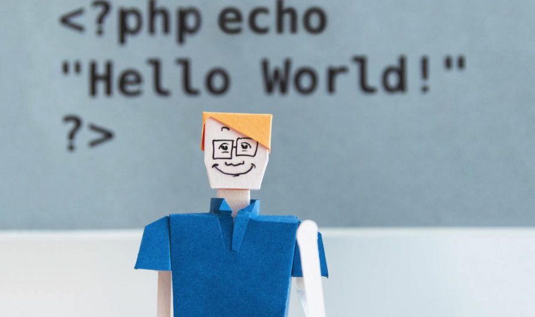
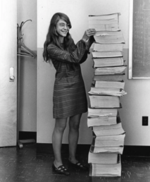

# To Be A Great Programmer: Mindset And Learning Strategy

原文： https://coderscat.com/to-be-a-programmer/

In my career as a software engineer, I met some great programmers and learned lots from them.

This post will give beginners some tips for the journey of being a great programmer, especially from the sides of mindset and learning strategy.

Mastering programming costs much of time. [Peter Norvig said ten years might be enough](https://norvig.com/21-days.html), so please keep patience and let’s get started.

## The mental model

Everyone can code, several years old boy could also produce some code which runnable.

However, being a great programmer requires much time and energy to polish skills. A prepared mindset will keep you growing in this long journey.

### Lifelong learning

> _“Self-education is, I firmly believe, the only kind of education there is” — Isaac Asimov_

Everything is changing very quickly, some technologies died away and some famed up every year. You don’t need to learn every fancy and fresh stuff, but you need to know the trends. And also have base skills to get up quickly when necessary.

John Carmack, the creator of Doom series games, was still trying to [learn a new programming language](https://sdtimes.com/john-carmack/oculus-cto-john-carmack-is-developing-scheme-scripting-language-for-vr/) and trying to apply it into products, even he had got in programming several decades. To be a good programmer, we must keep the belief of life long learning, and get ready for the fast pace of the computer industry.

### The Passion and Persistent

Programming is not easy. In a daily practice, programming maybe with the dark side of undocumented code, long time working day, pressure from a product release. If you are not passionate, debugging will flush your brain cells down the toilet. So, the first task in learning programming is to have fun and try to enjoy it.

In some sense, programming is creating a whole new world. A programmer who loves programming does not feel boring even with too much time spent on the keyboard; on the opposite, he will be enjoyable and satisfied.

### The Curiosity

To be a great software engineer, you need to be curious about many things.

Except for coding, many questions need to be answered. For instance:

*   _How is a function implemented in a library, what are the drawbacks and limitations of it?_
*   _How memory management in Linux is implemented?_
*   _Why we need threads in the Operating System, and when we will use them?_
*   _What happens when you are sending an HTTP request with a browser?_

The curiosity will push you to get the details of each corner, polish your skills, and force you to a higher level.

### Keep standards high

Typically, writing code that is just workable will cost not so much try. Sometimes you could find code snippets from the Internet, and paste it into the editor, luckily it works. But ….., workable code is a low standard, you need to keep it high. Keep a high standard for your work means you need to polish your work to perfection.

Coding is communicating with machines, but your code will be read by humans, which means you are communicating with other people through code.

Try to ask yourself these kinds of questions:

*   _Do you know the meaning of each line of code in the project?_
*   _Could your architecture is flexible for different future requirements?_
*   _Does it work for a much bigger data volume?_
*   _Does it readable and easy enough for other people to maintenance it?_

Many problems need to be solved for keeping a high standard, which will ultimately lead to complex challenges. This is the reason why big tech giants such as Google will employ engineers at a high standard.

### Collaboration

> _“Any fool can write code that a computer can understand. Good programmers write code that humans can understand. — Martin Fowler”_

When you get into an open-source project or work for some companies, you need to discuss the requirements, exchange ideas with others, present yourself to others, write documents, etc. For most programmers, expression skills (writing, presentation skills) will be a big plus for all the collaboration.

To practice writing skills, owning a tech blog is a perfect way. Here is a very detailed guide: [How to Start Your Programming Blog?](https://www.afternerd.com/blog/start-programming-blog/) I was inspired by afternerd.com to start my site.

[Soft Skills: The software developer’s life manual](https://amzn.to/2YDtc5x) is another good resource for this subject.

## How to learn

As a programmer, you need to study all the time. An important strategy is to learn how to learn, learn efficiently. If you got the pattern of how to master new things quickly, you would be got quicker and deeper for many fields, and become a better programmer.

[**_The Feynman Technique\\_**](https://www.youtube.com/watch?v=_f-qkGJBPts) provides a profound, fundamental, intuitive way for mastering new knowledge. It is designed as a technique to help you learn anything faster.

There are many common concepts in computer science. For almost everything, if you could explain it to others in plain words, it means you have mastered it totally, in your own way.

In other words, **_learning by teaching_** is an effective method.

**Learning by doing is another essential strategy.** Writing software is not rocket science; it’s more like a craft of skill, such as painting, dancing, playing basketball, or piano.

To be an expert, you need to keep practice every day, especially when you are a beginner, you need to spend much time to get the feeling of coding and debugging.

And then, you need to do some real projects, especially for some practical usage. To make sure you understand programming is to solve problems from the real world.

## The steps

### Master the basics

Like Chinese Kung Fu, the beginner will spend much time to get core strength before he studies some fancy things.

The history of computer science is about 50 years old, tools(programming languages, editors, platforms) and computing power changed drastically during the years, but fundamental theories developed slower. All programming languages today are Turing complete.

Margaret, in 1969, standing beside the listings of the actual Apollo Guidance Computer source code. Photo courtesy of the MIT Museum.

Here are the subjects you must master them:

*   Data structure and algorithms
*   Operation system
*   Compiler and programming languages
*   Computer Networking
*   Database

Go to get a CS degree in college if possible. A degree will be beneficial for applying for a job, but it’s not required.

A programmer is not a role like a scientist, which needs more formal academic training. On the opposite, many great programmers just graduate from high school.

For self-taught learners, you could find lots of helpful resources, [books for studying computer science](https://www.coderscat.com/best-cs-books) and programming. There are so many open-source projects, tutorials, and [open courses](https://online-learning.harvard.edu/subject/computer-science).

As a self-taught beginner, don’t do it all alone, try to connect with others. A good mentor will speed things up and help you avoid mistakes.

Make a plan for your learning path. You don’t need to make a very detailed plan, but be patient to follow it, and it maybe costs almost one year for [finishing a classic book such as SICP](https://eli.thegreenplace.net/tag/sicp).

By the way, [Structure and Interpretation of Computer Programs](https://amzn.to/2ZYDO0X)(SICP) is a book every real programmer should have a try.

### Find your track

There are many fields in the computer industry, during your career your maybe just focused on several fields. Game programming? Web development? System programming? Robot? So when you are young, try to find the hole you what to dig in. If you don’t know currently, **_[keep looking, don’t settle.](https://www.youtube.com/watch?v=BjnZ90XwMlM)_**

Your target is the one in which you enjoy yourself and satisfied mostly.

Make sure you have enough depth in one field before move on to another one. You need to be confident and get your learning patterns.

### Create some valuable thing

Create a [_Github_](http://github.com/) account if you didn’t have one, run!

Github is a great place where programmers share projects and ideas. It currently hosts most open-source projects.

You should learn the basic Git workflow. Try to clone other’s code, create a branch, and work on it, then push your code to remote repos.

Reviewing other’s code is helpful for yourself, and contributing to other open-source projects also help when you begin to apply for a job.

### Find a Job

The top programmer doesn’t have many opportunities to apply for a job, because the job will find them. Some other great coders don’t need to apply for a job because their open-source projects could make enough money to live. But most programmers need to apply for a job in normal cases.

The candidate needs to pass several rounds before getting the offer. The good news is that software engineers and other IT positions are still in very high demand.

For the interview process, the book: [Cracking The Coding Interview](https://amzn.to/2ZXDjDv) will save you much time; it is a very detailed guide for applying for jobs as a programmer.

As for the resume, owning or contributions to great open-source projects will be a spot, some Kernel programmers will just list the patch number in resume.

_The referral_ is an effective channel to apply for a job because many companies trust employee’s recommendations and pay some bonuses for a successful referral.

### Jump and expand yourself

During the starting years of your career, if you don’t get improving on yourself on working hours, just jump out and try to find a new job.

Your time is valuable, especially in your early career years, don’t hesitate.

> Always be the worst guy in every band you’re in. – so you can learn. The people around you affect your performance. Choose your crowd wisely. –Chad Fowler

When you got offers from big companies and small companies, [consider it seriously](https://lifehacker.com/is-it-better-to-work-for-a-large-or-small-company-496172191). Remember to find the company which fits your target in a long time, don’t consider the salary only, your career is a very long journey. Normally, the small company implies high risks and also potential high rewards.

## One more thing

Keep healthy is ultimately important. Some aged programmers have severe pains after long years of sitting. Finger injuries, heart disease, and fat are mainly healthy issues for programmers.

Keep a good lifestyle is the first advice for young programmers, keep enough time for exercise and rest. Coding is not the whole life, find a hobby, and enjoy your spare time.