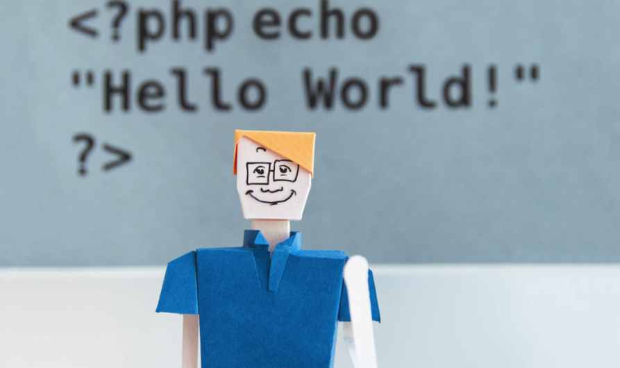
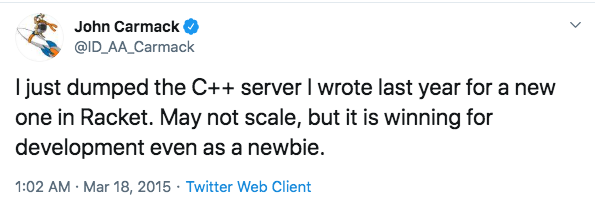
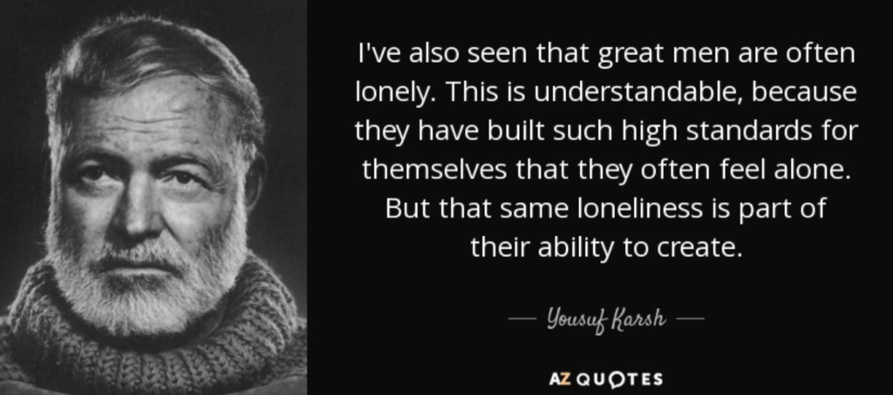
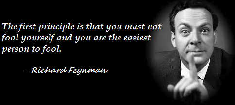
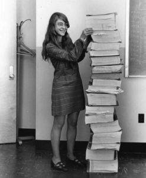

# 成为一名优秀的程序员：心智模型和学习策略

## 前言

在我作为软件工程师的职业生涯中，我遇到了一些伟大的程序员，并从他们身上学到了很多东西。

这篇文章将为初学者提供一些关于成为一名优秀程序员的旅程的提示，特别是从心态和学习策略方面。

掌握编程需要花费大量时间。 Peter Norvig 说[十年可能就足够了](https://norvig.com/21-days.html)，所以请保持耐心，让我们开始吧。

## 心智模型

每个人都会编程，几岁的孩子也能写出一些可运行的代码。然而，成为一名优秀的程序员需要大量的时间和精力来打磨技能。做好准备的心态会让你在这段漫长的旅程中不断成长。

### 终身学习

> “我坚信，自我教育是唯一的教育”  -- 艾萨克·阿西莫夫

一切都在快速变化，每年都会有些技术消失，也会有些技术会兴起而名声大噪。你不需要学习每一个花哨和新鲜的东西，但你需要了解趋势。并且还要具备必要时快速上手的基本技能。

《毁灭战士》系列游戏的创造者约翰·卡马克（John Carmack）尽管已经从事了几十年的编程，但仍在尝试学习一门新的编程语言并尝试将其应用到产品中。要成为一名优秀的程序员，我们必须保持终身学习的信念，为计算机行业的快节奏做好准备。

### 热情与执着

编程并不容易。在日常实践中，编程可能会面临无文档代码的阴暗面、长时间的工作以及来自产品发布的压力。如果你没有热情，调试会把你的脑细胞冲进马桶。所以，**学习编程的首要任务就是享受乐趣并尝试享受它**。

从某种意义上说，编程正在创造一个全新的世界。一个热爱编程的程序员，即使在键盘上花费太多时间，也不会感到枯燥；相反，他会感到愉快和满足。

### 好奇心

要成为一名出色的软件工程师，您需要对很多事情感到好奇。除了编码之外，还有很多问题需要回答。例如：

- 函数是在库中是如何实现的，它有哪些缺点和限制？
- Linux中的内存管理是如何实现的？
- 为什么我们在操作系统中需要线程，以及何时使用它们？
- 当您使用浏览器发送 HTTP 请求时会发生什么？

**好奇心会促使你去了解每个角落的细节，打磨你的技能，并迫使你达到更高的水平**。

### 保持高标准

> “我看到伟人往往是孤独的。这是可以理解的，因为他们为自己建立了如此高的标准，以至于他们经常感到孤独。但同样的孤独也是他们创造能力的一部分。” —— 欧内斯特·米勒尔·海明威

通常，编写可行的代码不会花费太多尝试。有时你可以从互联网上找到代码片段，然后将其粘贴到编辑器中，幸运的是它可以工作。但是......，可行的代码是一个低标准，你需要保持高标准。对工作保持高标准意味着您需要将工作打磨至完美。

编码是与机器交流，但你的代码会被人类阅读，这意味着你是通过代码与其他人交流。尝试问自己这些问题：

- 你知道项目中每一行代码的含义吗？
- 您的架构能否灵活地应付未来不同的需求？
- 它适用于更大的数据量吗？
- 它是否可读且易于其他人维护？

保持高标准需要解决许多问题，这最终将带来复杂的挑战。这就是为什么像谷歌这样的大型科技巨头会以高标准聘用工程师的原因。

### 合作

> “任何傻瓜都可以编写计算机可以理解的代码。优秀的程序员编写人类可以理解的代码。” ——马丁·福勒

当你进入一个开源项目或者在一些公司工作时，你需要讨论需求、与他人交流想法、向他人展示自己、编写文档等。对于大多数程序员来说，表达能力（写作、演示能力）对所有合作来说都是一个很大的优势。

要练习写作技巧，拥有一个技术博客是一个完美的方法。这是一个非常详细的指南：[如何开始您的编程博客？](https://www.afternerd.com/blog/start-programming-blog/) 我受到 afternerd.com 的启发开始创建我的网站。

[软技能：软件开发人员的生活手册](https://amzn.to/2YDtc5x)是该主题的另一个很好的资源。

## 如何学习

作为一名程序员，你需要时刻学习。一个重要的策略是学会如何学习、高效学习。如果你掌握了如何快速掌握新事物的模式，你就会在很多领域更快、更深入，并成为一名更好的程序员。

> “第一条原则是你不能欺骗自己，而你是最容易欺骗的人。” -- 理查德·费曼

[费曼学习法](https://www.youtube.com/watch?v=_f-qkGJBPts)为掌握新知识提供了一种深刻的、基础的、直观的方法。它被设计为一种帮助您更快地学习任何东西的技术。

计算机科学中有许多常见的概念。对于几乎所有的事情，如果你能用通俗易懂的语言向别人解释它，那就意味着你已经以自己的方式完全掌握了它。

换句话说，**教而学是一种有效的方法**。

**边做边学是另一个重要策略**。编写软件并不是火箭科学。它更像是一门技能，比如绘画、跳舞、打篮球或钢琴。

要成为专家，你需要每天不断练习，尤其是当你是初学者时，你需要花很多时间来获得编码和调试的感觉。

然后，你需要做一些实际的项目，特别是一些实际用途。确保你理解编程就是解决现实世界的问题。

## 实施步骤

### 掌握基础知识

就像中国功夫一样，初学者在学习一些花哨的东西之前会花很多时间来获得核心力量。

计算机科学的历史大约有50年，工具（编程语言、编辑器、平台）和计算能力在这些年里发生了巨大的变化，但基础理论发展较慢。今天所有的编程语言都是图灵完备的。

> 1969 年，玛格丽特站在实际的阿波罗制导计算机源代码列表旁边。照片由麻省理工学院博物馆提供

以下是您必须掌握的科目：

- 数据结构和算法
- 操作系统
- 编译器和编程语言
- 计算机网络
- 数据库

如果可能的话，去大学获得 CS 学位。学位对于申请工作很有帮助，但这不是必需的。程序员不是像科学家那样的角色，它需要更正式的学术培训。相反，许多伟大的程序员刚从高中毕业。

对于自学成才的学习者，您可以找到许多有用的资源，用于[研究计算机科学和编程的书籍](https://www.coderscat.com/best-cs-books)。有很多[开源项目](https://online-learning.harvard.edu/subject/computer-science)，教程和开放课程。

作为一个自学成才的初学者，不要一个人做，尝试与他人建立联系。好的导师将加快事情的速度，并帮助您避免错误。

为你的学习路径制定计划。不需要制定很详细的计划，但要有耐心去执行，像[SICP这样的经典书籍](https://eli.thegreenplace.net/tag/sicp)读完可能要花差不多一年的时间。

#### 找到你的轨道

计算机行业有很多领域，在您的职业生涯中，您可能只专注于几个领域。游戏编程？网页开发？系统编程？机器人？所以当你年轻的时候，试着找到你要挖的洞。如果你现在不知道，那就[继续寻找，不要安于现状](https://www.youtube.com/watch?v=BjnZ90XwMlM)。

**你的目标应该是你最享受和最满意的目标**。在转向另一领域之前，请确保您在一个领域有足够的深度。您需要充满信心并掌握自己的学习模式。

### 创造一些有价值的东西

如果您还没有 [Github](http://github.com/) 帐户，请创建一个，然后使用起来！

Github 是程序员分享项目和想法的好地方。目前它托管着大多数开源项目。您应该学习基本的 Git 工作流程。尝试克隆其他人的代码，创建一个分支并对其进行处理，然后将您的代码推送到远程存储库。

审查他人的代码对你自己很有帮助，为其他开源项目做出贡献也会对你开始申请工作有所帮助。

### 找一个工作

顶级程序员没有太多申请工作的机会，因为工作会找到他们。其他一些优秀的程序员不需要申请工作，因为他们的开源项目可以赚到足够的钱来维持生计。但大多数程序员在正常情况下都需要申请工作。

候选人需要通过几轮面试才能获得offer。好消息是软件工程师和其他 IT 职位的需求量仍然很高。

对于面试过程，《[Cracking The Coding Interview](https://amzn.to/2ZXDjDv)》这本书会为你节省很多时间；这是申请程序员职位的非常详细的指南。

推荐是申请工作的有效渠道，因为许多公司信任员工的推荐，并为成功的推荐支付一些奖金。

#### 跳跃并扩展自己

在你职业生涯的最初几年，如果你没有在工作时间上提高自己，那就跳出来尝试寻找新工作。

> “永远成为你所在的每个乐队中最差的人。——这样你就可以不断学习。你周围的人会影响你的表现。明智地选择你的人群。” ——查德·福勒

当你收到大公司和小公司的offer时，[请认真考虑一下](https://lifehacker.com/is-it-better-to-work-for-a-large-or-small-company-496172191)。记住要找到适合你长期目标的公司，不要只考虑薪水，你的职业生涯是一个很漫长的旅程。通常，小公司意味着高风险，也意味着潜在的高回报。

## 最后一件事

保持健康至关重要。一些年长程序员在长年久坐后会感到剧烈疼痛。手指受伤、心脏病和肥胖是程序员主要的健康问题。

保持良好的生活方式是给年轻程序员的第一条建议，保持足够的运动和休息时间。编码不是生活的全部，找到一个爱好，享受你的业余时间。

