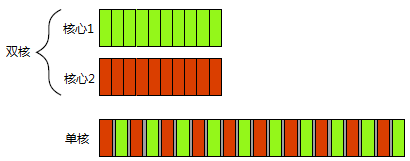

---
hide:
  - toc
---

# C++ 并发编程实战（第一版）

**译文地址**：https://github.com/xiaoweiChen/Cpp_Concurrency_In_Action

**阅读地址**：https://www.bookstack.cn/books/Cpp_Concurrency_In_Action

**第二版译文地址**：https://github.com/xiaoweiChen/CPP-Concurrency-In-Action-2ed-2019

**第三方笔记（第二版）**：https://github.com/downdemo/Cpp-Concurrency-in-Action-2ed


## chap1: 你好，C++的并发世界

### 何谓并发

计算机领域的并发指的是在单个系统里同时执行多个独立的任务，而非顺序的进行一些活动。

<figure markdown="span">


<figcaption>并发的两种方式：双核机器的真正并行 Vs. 单核机器的任务切换</figcaption>
</figure>

- **单核机器的任务切换实现并发**：通过“这个任务做一会，再切换到别的任务，再做一会儿”的方式，让任务看起来是并行执行的。这种方式称为任务切换。
- **多核处理器的并发是硬件并发(hardware concurrency)**：真正的并发（这里面准确说是并行，并行是并发的一种情况）

#### 并发的途径

##### 多进程并发

多进程并发是将应用程序分为多个独立的进程，它们在同一时刻运行。独立的进程间可以通过进程间常规的通信渠道传递讯息(信号、套接字、文件、管道等等)

<figure markdown="span">

<figcaption>一对并发运行的进程之间的通信</figcaption>
</figure>

多进程并发缺点有：
- **进程间通信慢**：进程之间的通信通常不是设置复杂，就是速度慢，这是因为操作系统会在进程间提供了一定的保护措施，以避免一个进程去修改另一个进程的数据
- **运行进程的开销高**：运行多个进程所需的固定开销比较大，需要时间启动进程，操作系统需要内部资源来管理进程。

多线程并发优点：

- **可以更容易编写安全的并发代码**：一个进程crash 掉了不影响其他进程。
- **可以通过 socket 等方式进行远程连接，在不同的机器上运行独立的进程**。

##### 多线程并发

多线程并发，指的是在单个进程中运行多个线程。线程很像轻量级的进程：每个线程相互独立运行，且线程可以在不同的指令序列中运行。但是，进程中的所有线程都共享地址空间，并且所有线程访问到大部分数据———全局变量仍然是全局的，指针、对象的引用或数据可以在线程之间传递。

<figure markdown="span">

<figcaption>同一进程中的一对并发运行的线程之间的通信</figcaption>
</figure>

多线程并发优点：

- 多线程相关开销远小于多个进程：因为地址空间共享的，线程进行切换时候，不涉及 TLB 方面内容。
- 共享内存具有灵活性，缺点需要保证每个线程所访问到的数据的一致性。

### 为什么使用并发？

使用并发的目的主要有两个：

- 关注点分离（SOC）
- 性能

#### 为了分离关注点

编写软件时，分离关注点是个好主意；通过将相关的代码与无关的代码分离，可以使程序更容易理解和测试，从而减少出错的可能性。即使一些功能区域中的操作需要在同一时刻发生的情况下，依旧可以使用并发分离不同的功能区域；若不显式地使用并发，就得编写一个任务切换框架，或者在操作中主动地调用一段不相关的代码。

#### 为了性能

另一个使用并发的原因是为了性能。有两种并发手段可以提高性能：

- **任务并行（task parallelism）**：将一个单个任务分成几部分，且各自并行运行，从而降低总运行时间。
- **数据并行（data parallelism）**：将一个数据集分成几份，且各自并行处理，从而降低总运行时间，带来吞吐量的提升。

### 开始入门

#### 你好，并发世界

```cpp
--8<-- "docs/cpp-concurrency-in-action/src/chap1/first_example.cpp"
```

## chap2: 线程管理

### 基础

#### 启动线程

线程创建时候，需要为线程设置启动函数。

示例 1：使用普通函数

```cpp
void do_some_work();
std::thread my_thread(do_some_work)
```

示例 2： 使用函子（也称函数对象）

```cpp
--8<-- "docs/cpp-concurrency-in-action/src/chap2/functor_thread.cpp"
```

使用函数对象时候，需要注意不用错误地使用了函数声明，而应该使用函数对象：

=== "函数对象"
    ```cpp
    class MyClass {
        void operator()() const { std::cout << "background task\n"; }; // 重载了()运算符
    };
    Myclass my_object; // 类对象，当它作为普通函数使用时候，称为函数对象

    std::thread t(my_object);
    ```

=== "函数声明"

    ```cpp
    class MyClass {
        void operator()() const { std::cout << "background task\n"; }; // 重载了()运算符
    };
    Myclass my_object(); // 函数声明

    std::thread t(my_object()); // 错误，此时是函数声明
    ```

创建线程之后，如果不等待线程完成，可能会发生线程访问旧的局部变量：

```cpp
--8<-- "docs/cpp-concurrency-in-action/src/chap2/thread_dangling_reference.cpp"
```

#### 等待线程完成

如果需要等待线程结束，可以使用join()函数。join()函数会阻塞当前线程，直到线程完成。对于一个线程，join()只能使用一次，再次使用会发生异常。我们可以使用 joinable()函数来检查线程是否可以join。

**当主线程没有等待到线程完成，程序就会退出，此时线程会运行 teriminate() 来结束掉线程**。

##### 特殊情况下的等待

当在 join 调用之前，程序抛出异常时，会导致无法等待线程完成。

解决办法 1 是在 catch 块中调用 join。

```cpp
#incldue "func_header.hpp"

void f()
{
    int some_local_state=0;
    func my_func(some_local_state);
    std::thread t(my_func);
    try
    {
    do_something_in_current_thread();
    }
    catch(...)
    {
    t.join();  // 1
    throw;
    }
    t.join();  // 2
}
```

另外一种方式是使用 RAII(Resource Acquisition Is Initialization，资源获取即初始化方式)，提供一个类，在析构函数中使用 join：

```cpp
#include "func_header.hpp"

class thread_guard
{
    std::thread& t;
public:
    explicit thread_guard(std::thread& t_):// 1
    t(t_)
    {}
    ~thread_guard()
    {
    if(t.joinable()) // 2
    {
        t.join();      // 3
    }
    }
    thread_guard(thread_guard const&)=delete;   // 4
    thread_guard& operator=(thread_guard const& =delete; // 5
};

void f()
{
    int some_local_state=0;
    func my_func(some_local_state);
    std::thread t(my_func);
    thread_guard g(t);
    do_something_in_current_thread();
}
```

上面代码解释说明：

- 1处的 explicit 关键字，防止隐式转换，当类的构造函数中只有一个参数时候，默认支持隐式转换的：

    ```cpp
    thread t(my_func);
    thread_guard tg = t; // 隐式转换，当加explicit 关键字，不允许这种操作，只能如下：
    thread_guard tg(t);
    ```

- 2,3处，如果线程没有 join，那么在析构函数中会调用 join，否则不会。
- 4,5处，防止拷贝构造函数和赋值操作符被调用。目的是为了不让编译器自动生成它们。直接对一个对象进行拷贝或赋值是危险的，因为这可能会弄丢已经加入的线程。通过删除声明，任何尝试给thread_guard对象赋值的操作都会引发一个编译错误。

#### 后台运行线程

可以通过在线程对象中调用detach()函数，将线程设置为后台线程，此后这个对象也是无法加入的了。

```cpp
std::thread t(do_background_work);
t.detach(); // 将线程设置为后台运行
assert(!t.joinable()); // 该线程无法join 了，此处一定断言成功
```

### 向线程函数传递参数

std::thread 线程函数可以接受任意个参数，这些参数会传递给线程函数。std::thread 中第一个参数是线程函数，其余参数是该线程函数的参数。

#### 线程传参的两类问题

##### 传递了局部变量到线程中，造成悬垂引用

C++字符串类型 `std::string`(因为`std::string` 是整个生命周期内都有效的对象) 可以安全的传递给线程独立内存中：

```cpp
void f(int i, std::string const& s);
std::thread t(f, 3, "hello");
```
上面代码中尽管 `hello` 类型是 `char const *` 类型，当会在线程的上下文中完成字面值向 `std::string` 对象的转换。

局部变量造成的问题的示例：

```cpp
void f(int i,std::string const& s);
void oops(int some_param)
{
    char buffer[1024]; // 局部变量
    sprintf(buffer, "%i",some_param);
    std::thread t(f,3,buffer); // 当 oops 执行完成之后，buffer变成了悬垂指针
    t.detach();
}
```

当 oops 执行完成之后，局部变量 buffer 会释放，线程 t 再次访问时候会导致悬垂引用。解决办法可以将 buffer 转换成 std::string 类型：

```cpp
void f(int i,std::string const& s);
void not_oops(int some_param)
{
    char buffer[1024];
    sprintf(buffer,"%i",some_param);
    std::thread t(f,3,std::string(buffer));  // 使用std::string，避免悬垂指针
    t.detach();
}
```

##### 期待传递一个引用，却传递了一个值对象

```cpp
void update_data_for_widget(widget_id w,widget_data& data); // 1
void oops_again(widget_id w)
{
    widget_data data;
    std::thread t(update_data_for_widget,w,data); // 2
    display_status();
    t.join();
    process_widget_data(data); // 3
}
```

上面代码中尽管 1 处期待第二个参数是传入一个引用，但 2 处的 std::thread 的构造函数并不知晓，它将无视函数 prcess_widget_data 期待的参数类型，而是将 data 的副本作为第二个参数传递给 update_data_for_widget。这就导致在线程函数中修改了 data，而 oops_again 外面访问到的data 数据依旧没有变。

解决办法是使用 std::ref 将参数转换成引用类型：

```cpp
std::thread t(update_data_for_widget,w,std::ref(data));
```

#### 类成员函数作为线程函数

我们可以传递一个类成员函数指针作为线程函数，第一个参数是对象指针，第二个参数是函数参数，以此类推。

```cpp
--8<-- "docs/cpp-concurrency-in-action/src/chap2/class_method_thread.cpp"
```

#### 移动对象到线程中

线程函数中参数默认是拷贝过去的，但我们可以借助 std::unique_ptr 来实现移动，将参数移动到线程函数中：

```cpp
void process_big_object(std::unique_ptr<big_object>);

std::unique_ptr<big_object> p(new big_object);
p->prepare_data(42);
std::thread t(process_big_object,std::move(p));
```

**对于函数参数或函数返回的类型声明了右值引用类型时候，若原对象是一个临时变量时，自动进行移动操作，若原对象是一个命名变量，那么转移的时候就需要使用std::move()进行显示移动**。

### 转移线程所有权

C++标准库中有很多资源占有(resource-owning)类型，比如`std::ifstream`，`std::unique_ptr`，`std::thread`等，它们都是 **可移动，但不可拷贝的**。

??? "“可移动，但不可拷贝”如何理解？"
    在 C++ 中，"可移动，但不可拷贝" 是指一个对象可以被移动，但不能被拷贝（复制）。这是 C++11 引入移动语义后的一个常见设计模式，特别适用于管理资源所有权（如动态内存、文件句柄、网络连接等）的类。这种设计模式的核心思想是：

    1. **不可拷贝（复制）**：类的拷贝构造函数和拷贝赋值操作符被删除或私有化，使得对象不能被拷贝。这是通过显式地删除这些函数来实现的，如下所示：

        ```cpp
        class NonCopyable {
        public:
            NonCopyable() = default;
            ~NonCopyable() = default;

            // 删除拷贝构造函数
            NonCopyable(const NonCopyable&) = delete;
            // 删除拷贝赋值操作符
            NonCopyable& operator=(const NonCopyable&) = delete;
        };
        ```

        在这个例子中，`NonCopyable` 类的拷贝构造函数和拷贝赋值操作符都被删除了，这意味着你不能通过拷贝来创建这个类的额外实例。

    2. **可移动**：类提供移动构造函数和移动赋值操作符，允许对象在资源转移时被“移动”。移动构造函数和移动赋值操作符接受一个右值引用参数，如下所示：

        ```cpp
        class Movable {
        public:
            Movable() = default;
            ~Movable() = default;

            // 移动构造函数
            Movable(Movable&& other) : data_(std::move(other.data_)) {
                other.data_ = nullptr; // 将资源所有权转移后，将原对象的指针置空
            }

            // 移动赋值操作符
            Movable& operator=(Movable&& other) {
                if (this != &other) {
                    data_ = std::move(other.data_);
                    other.data_ = nullptr;
                }
                return *this;
            }

        private:
            int* data_;
        };
        ```

        在这个例子中，`Movable` 类的移动构造函数和移动赋值操作符都被定义了，它们使用 `std::move` 来转移资源的所有权。移动操作通常涉及将资源从一个对象转移到另一个对象，而不是复制资源。

    ### 为什么采用这种设计？

    这种设计模式的优势在于：

    - **资源管理**：它有助于确保资源不会被不必要地复制，从而避免资源泄漏或不必要的性能开销。
    - **异常安全**：通过避免复制，可以减少在资源管理过程中发生异常的风险。
    - **所有权明确**：它明确了资源的所有权，使得资源的管理和释放更加直观和安全。

    ### 典型应用
    这种模式通常用于智能指针（如 `std::unique_ptr`）、文件流（如 `std::ofstream`）、网络连接等资源管理类。例如，`std::unique_ptr` 就是一个典型的 "可移动，但不可拷贝" 的类，它通过移动语义来安全地转移资源的所有权。

    总结来说，"可移动，但不可拷贝" 是一种资源管理策略，它通过禁止拷贝并支持移动来优化资源的使用和提高程序的安全性。


示例：创建两个执行线程，并在实例之间转移所有权：

```cpp
--8<-- "docs/cpp-concurrency-in-action/src/chap2/thread_owership.cpp"
```

#### 作为函数返回值转移所有权

```cpp
std::thread f()
{
    void some_function();
    return std::thread(some_function);
}

std::thread g()
{
    void some_other_function(int);
    std::thread t(some_other_function,42);
    return t;
}
```

#### 作为函数参数转移所有权

```cpp
void f(std::thread t);
void g()
{
    void some_function();
    f(std::thread(some_function));
    std::thread t(some_function);
    f(std::move(t));
}
```

上面代码中 f 函数即使没有显示声明接受一个右值引用，但是 std::thread 的函数构造函数和赋值操作符都被删除了，使得 std::thread 对象不能被拷贝或赋值，但可以被移动。因此，std::thread 对象在被创建时（如 std::thread(some_function)）是一个右值，可以被移动构造到 f 函数的参数 t 中。

当你使用 std::move(t) 时，你实际上是在显式地将 t 转换为一个右值引用，这会触发 f 函数的移动构造版本（如果存在的话）。但是，即使 f 的参数 t 被声明为一个左值引用（std::thread&），它仍然可以接收一个右值，因为左值引用可以绑定到右值上，这是 C++ 的一个特性。

然而，最佳实践是将这类函数的参数声明为右值引用，以明确表示函数的意图是移动而不是拷贝传入的对象。因此，更明确的声明应该是：

```cpp
void f(std::thread&& t);
```
这样的声明清楚地表明了 f 函数期望接收一个右值引用，并且会移动传入的对象。这不仅使得代码的意图更加清晰，也避免了潜在的混淆。

f(std::thread(some_function)); 创建了一个临时的 std::thread 对象，它是一个右值，可以被移动到 f 函数的参数中。而 f(std::move(t)); 显式地将 t 转换为右值引用，这也能够工作，因为 std::move 只是将对象转换为右值引用，而 f 函数的参数可以接受任何 std::thread 类型的对象，无论是左值还是右值。

#### 基于移动语义实现等待线程完成

将线程移动到 scoped_thread 类中，并在析构函数中调用 join()来实现等待线程完成。

```cpp
class scoped_thread
{
    std::thread t;
public:
    explicit scoped_thread(std::thread t_):t(std::move(t_)) {
        if(!t.joinable())                                 
            throw std::logic_error("No thread");
    }
    ~scoped_thread() {
        t.join();
    }

    scoped_thread(scoped_thread const&)=delete;
    scoped_thread& operator=(scoped_thread const&)=delete;
};

// 使用示例
#include "func_header.hpp"
void f()
{
    int some_local_state;
    scoped_thread t(std::thread(func(some_local_state)));
    do_something_in_current_thread();
}
```

#### 多个工作线程并等待结束

```cpp
void do_work(unsigned id);
void f()
{
    std::vector<std::thread> threads;
    for(unsigned i=0; i < 20; ++i)
    {
    threads.push_back(std::thread(do_work,i)); // 产生线程
    } 
    std::for_each(threads.begin(),threads.end(),
                    std::mem_fn(&std::thread::join)); // 对每个线程调用join()
}
```

### 运行时决定线程数量

`std::thread::hardware_concurrency()` 返回当前系统的硬件并发能力，返回值是一个无符号整数，表示可以同时运行的线程数。当系统信息无法获取时，函数返回0。

#### 原生并行版的 std::accumulate

```cpp
template<typename Iterator,typename T>
struct accumulate_block
{
    void operator()(Iterator first,Iterator last,T& result)
    {
    result=std::accumulate(first,last,result);
    }
};

template<typename Iterator,typename T>
T parallel_accumulate(Iterator first,Iterator last,T init)
{
    unsigned long const length=std::distance(first,last);
    if(!length) { // 如果输入范围为空，返回 init值
        return init;
    }
    
    unsigned long const min_per_thread=25; // 每个线程工作的任务数默认是 25 个
    unsigned long const max_threads=
        (length+min_per_thread-1)/min_per_thread; // 完成所有任务需要的最大线程数

    unsigned long const hardware_threads=
        std::thread::hardware_concurrency();

    unsigned long const num_threads=  
        std::min(hardware_threads != 0 ? hardware_threads : 2, max_threads); // 实际核数与所需核数取最小值

    unsigned long const block_size=length/num_threads; // 每个线程的任务数

    std::vector<T> results(num_threads); // 存储结果

    std::vector<std::thread> threads(num_threads-1);  // 创建线程数组

    Iterator block_start=first;
    for(unsigned long i=0; i < (num_threads-1); ++i)
    {
        Iterator block_end=block_start;
        std::advance(block_end,block_size);

        threads[i]=std::thread(
            accumulate_block<Iterator,T>(),
            block_start,block_end,std::ref(results[i]));

        block_start=block_end;
    }

    accumulate_block<Iterator,T>()( // 最后一个线程
        block_start,last,results[num_threads-1]);
    
    // 等待所有线程结束
    std::for_each(threads.begin(),threads.end(),
        std::mem_fn(&std::thread::join));

    // 汇总结果
    return std::accumulate(results.begin(),results.end(),init);
}
```

### 识别线程

我们可以通过 `std::this_thread::get_id()` 来识别当前线程。`get_id()` 返回 `std::thread::id` 类型的对象，它表示当前线程的 ID。

```cpp
std::thread::id master_thread;
void some_core_part_of_algorithm()
{
    if(std::this_thread::get_id()==master_thread)
    {
        do_master_thread_work(); // 如果是主线程
    } else {
        do_common_work();
    }
}
```


