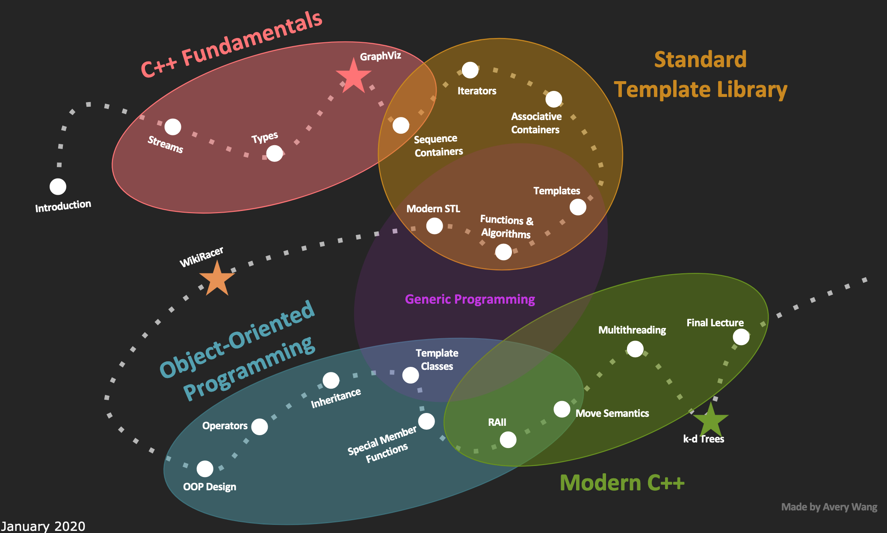

# cs106L: C++标准库编程

## 概要

斯坦福公开课：**cs106L: C++标准库编程(2020)**，对应课程地址：https://web.stanford.edu/class/archive/cs/cs106l/cs106l.1204/index.html。

配套在线观看地址：https://www.bilibili.com/video/BV19x4y1E79V/?vd_source=f3e532bab07bd39d7aa9e7d412b650c5。

## 简介 Intro

### CS106L课程目标 Goals of CS 106L

1. Learn what features are out there in C++ and why they exist. 了解 C++ 中有哪些功能以及它们存在的原因。
2. Become comfortable with reading C++ documentation. 习惯阅读 C++ 文档。
3. Become familiar with the design philosophy of modern C++. 熟悉现代C++的设计哲学。



### C++语言历史 History of C++

从`Hello, world`说起。

=== "C++ 版本"
    ```cpp
    #include <iostream>

    int hello_cpp() {
        std::cout << "Hello, world!" << std::endl;
        return 0;
    }

    int main() {
        hello_cpp();
    }
    ```
=== "C 版本"
    ```c
    #include "stdio.h"
    #include "stdlib.h"

    int hello_c() {
        printf("%s", "Hello, world!\n");
        return EXIT_SUCCESS;
    }

    int main() {
        hello_c();
    }
    ```
=== "汇编版本(C语言嵌套汇编)"

    ```asm

    #include "stdio.h"
    #include "stdlib.h"

    /*
    * Wrapper function for convenience
    */
    void myputs(char *s) {
        puts(s);
    }

    /*
    * This will probably not work on your computer.
    * Assembly is not at all portable; a good
    * reason to avoid using it!
    *
    * Those of you who have taken 107 should
    * be able to somewhat see what is happening here.
    */
    int hello_as() {
        /* The assembly literally writes the hex representation
        * of as big a portion of the string as it can into the addresses
        * at range rsp to rsp + 0xd. That range is exactly 12 bytes long
        * as there are 12 characters in the "Hello, wordl!" string.
        */
        asm("sub    $0x20,%rsp\n\t"
            "movabs $0x77202c6f6c6c6548,%rax\n\t"   // moves "Hello, w" portion to mem at $rsp
            "mov    %rax,(%rsp)\n\t"
            "movl   $0x646c726f, 0x8(%rsp)\n\t"     // moves "orld"  portion to mem at $rsp + 8
            "movw   $0x21, 0xc(%rsp)\n\t"           // moves "!" portion to mem at $rsp + 12
            "movb   $0x0,0xd(%rsp)\n\t"             // moves string null terminator to mem at $rsp + 13
            "leaq    (%rsp),%rax\n\t"               // loads address of $rsp as first argument to puts
            "mov    %rax,%rdi\n\t"
            "call  __Z6myputsPc\n\t"                // calls puts
            "add    $0x20, %rsp\n\t"
        );
        return EXIT_SUCCESS;
    }

    int main() {
        hello_as();
    }
    ```
=== "纯汇编"

    ```asm
    section .text
    global _start ;must be declared for linker (ld)

    _start: ;tell linker entry point
        mov edx,len ;message length
        mov ecx,msg ;message to write
        mov ebx,1 ;file descriptor (stdout)
        mov eax,4 ;system call number (sys_write)
        int 0x80 ;call kernel
        mov eax,1 ;system call number (sys_exit)
        int 0x80 ;call kernel

    section .data
    msg db 'Hello, world!',0xa ;our dear string
    len equ $ - msg ;length of our dear string
    ```

### 汇编

好处(Benefits)：

- Unbelievably simple instructions 指令简单的令人难以置信
- Extremely fast (when well-written) 如果写得好的话，速度极快
- Complete control over your program 你可以完全控制你的程序

缺点：

- Requires lots of code to do simple tasks 需要大量代码来完成简单的任务
- Hard to understand other people’s code 很难理解别人的代码
- Extremely unportable 极其不具有可移植性

### C语言的诞生(Invention of C )

Writing assembly was too difficult but computers only
understood assembly.

编写汇编太难了，只有计算机才能了解汇编。于是C语言诞生了:

- 可以用更直观的方式编写源代码
- 通过可以将其转换为汇编语言

K&R(**K** en Thompson(肯·汤普森) and Dennis **R** itchie(丹尼斯·里奇))在 1972 年创建了 C，C 使编写代码变得容易: 

- 快速 Fast
- 简单 Simple
- 跨平台 Cross-platform

C语言缺点(weakness)：

- 无对象或类 No objects or classes
- 很难编写通用的代码 Difficult to write code that worked generically
- 编写大型程序时很乏味 Tedious when writing large programs

### C++语言的诞生

1983 年，C++ 的第一个遗迹由比亚恩·斯特鲁斯特鲁普(Bjarne Stroustrup)创造。他想要一种语言：

- 快速 Fast
- 简单易用 Simple to Use
- 跨平台 Cross-platform
- 具有高级功能 Had high level features

### C++的设计哲学 Design Philosophy of C++

- Allow the programmer full control, responsibility, and
choice if they want it. 允许程序员完全控制、负责和如果他们想要的话，可以选择。
- Express ideas and intent directly in code. 直接在代码中表达想法和意图。

    以下面求整数向量的和为例:

    === "方式1"
        ```c++
        vector<int> vec = {1, 2, 3};
        int sum = 0;
        for (auto val : vec) {
            sum += val;
        }
        ```
    === "方式2"
        ``` cpp
        vector<int> vec = {1, 2, 3};
        int sum = 0;
        for (const auto& val : vec) { // 相比方式1，表明只是访问向量的值
            sum += val;
        }
        ```

    === "方式3"
        ```cpp
        vector<int> vec = {1, 2, 3};
        int sum = std::accumulate(vec.begin(), vec.end(), 0); // 相比方式2，语义性更强，
        // 一眼可以看出来是向量求和
        ```
- Enforce safety at compile time whenever possible. 尽可能在编译时强制执行安全性。
- Do not waste time or space. 不浪费时间或空间。
- Compartmentalize messy constructs. 划分混乱的结构。