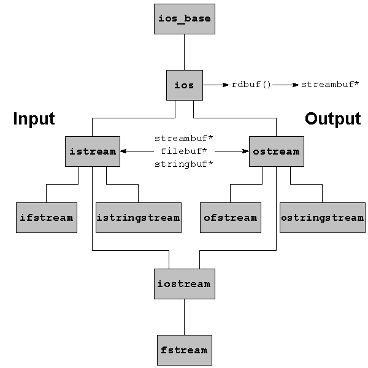
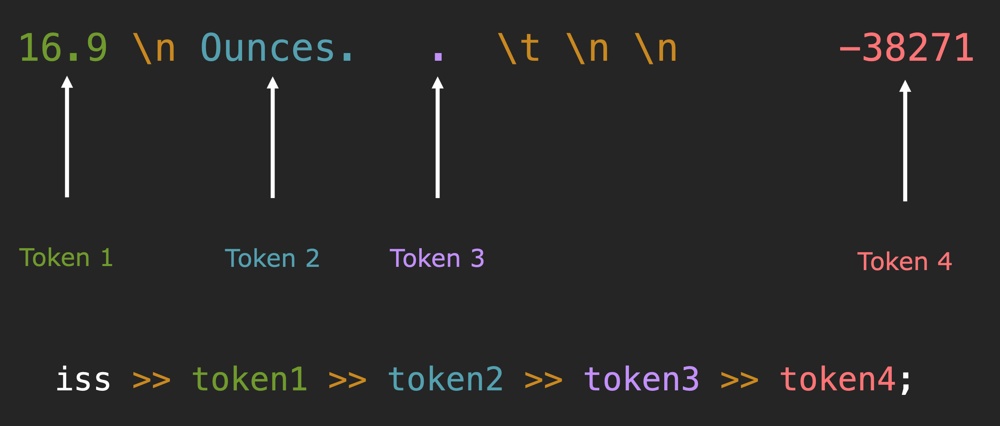
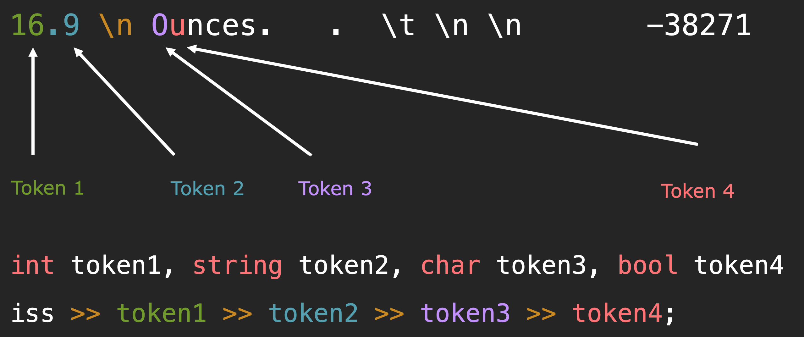
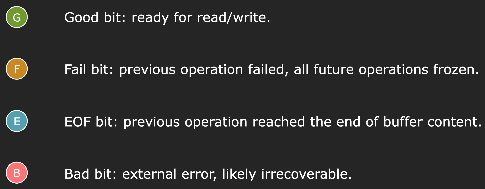

---
hide:
  - toc
---
# cs106L: C++标准库编程

## 概要

**课程名称**：斯坦福公开课：**cs106L: C++标准库编程(2020)**

**课程地址**：https://web.stanford.edu/class/archive/cs/cs106l/cs106l.1204/index.html。

**在线观看地址**：https://www.bilibili.com/video/BV19x4y1E79V/?vd_source=f3e532bab07bd39d7aa9e7d412b650c5。

**工具**：

- 在线编译器：https://www.onlinegdb.com/online_c++_compiler
- C++语言参考：https://cplusplus.com/reference/

**部分笔记内容来自**：

- [C++ Annotations Version 13.00.00](http://www.icce.rug.nl/documents/cplusplus/)
- [programiz.com C++ Tutorial](https://www.programiz.com/cpp-programming/standard-template-library)
- [C++ Language Tutorial](https://cplusplus.com/doc/tutorial/)

## 简介

### CS106L课程目标

Goals of CS 106L:

1. Learn what features are out there in C++ and why they exist. 了解 C++ 中有哪些功能以及它们存在的原因。
2. Become comfortable with reading C++ documentation. 习惯阅读 C++ 文档。
3. Become familiar with the design philosophy of modern C++. 熟悉现代C++的设计哲学。


### C++语言历史

从`Hello, world`说起。

=== "C++ 版本"
    ```cpp
    #include <iostream>

    int hello_cpp() {
        std::cout << "Hello, world!" << std::endl;
        return 0;
    }

    int main() {
        hello_cpp();
    }
    ```
=== "C 版本"
    ```c
    #include "stdio.h"
    #include "stdlib.h"

    int hello_c() {
        printf("%s", "Hello, world!\n");
        return EXIT_SUCCESS;
    }

    int main() {
        hello_c();
    }
    ```
=== "汇编版本(C语言嵌套汇编)"

    ```asm

    #include "stdio.h"
    #include "stdlib.h"

    /*
    * Wrapper function for convenience
    */
    void myputs(char *s) {
        puts(s);
    }

    /*
    * This will probably not work on your computer.
    * Assembly is not at all portable; a good
    * reason to avoid using it!
    *
    * Those of you who have taken 107 should
    * be able to somewhat see what is happening here.
    */
    int hello_as() {
        /* The assembly literally writes the hex representation
        * of as big a portion of the string as it can into the addresses
        * at range rsp to rsp + 0xd. That range is exactly 12 bytes long
        * as there are 12 characters in the "Hello, wordl!" string.
        */
        asm("sub    $0x20,%rsp\n\t"
            "movabs $0x77202c6f6c6c6548,%rax\n\t"   // moves "Hello, w" portion to mem at $rsp
            "mov    %rax,(%rsp)\n\t"
            "movl   $0x646c726f, 0x8(%rsp)\n\t"     // moves "orld"  portion to mem at $rsp + 8
            "movw   $0x21, 0xc(%rsp)\n\t"           // moves "!" portion to mem at $rsp + 12
            "movb   $0x0,0xd(%rsp)\n\t"             // moves string null terminator to mem at $rsp + 13
            "leaq    (%rsp),%rax\n\t"               // loads address of $rsp as first argument to puts
            "mov    %rax,%rdi\n\t"
            "call  __Z6myputsPc\n\t"                // calls puts
            "add    $0x20, %rsp\n\t"
        );
        return EXIT_SUCCESS;
    }

    int main() {
        hello_as();
    }
    ```
=== "纯汇编版本"

    ```asm
    section .text
    global _start ;must be declared for linker (ld)

    _start: ;tell linker entry point
        mov edx,len ;message length
        mov ecx,msg ;message to write
        mov ebx,1 ;file descriptor (stdout)
        mov eax,4 ;system call number (sys_write)
        int 0x80 ;call kernel
        mov eax,1 ;system call number (sys_exit)
        int 0x80 ;call kernel

    section .data
    msg db 'Hello, world!',0xa ;our dear string
    len equ $ - msg ;length of our dear string
    ```

### 汇编

好处(Benefits)：

- Unbelievably simple instructions 指令简单的令人难以置信
- Extremely fast (when well-written) 如果写得好的话，速度极快
- Complete control over your program 你可以完全控制你的程序

缺点：

- Requires lots of code to do simple tasks 需要大量代码来完成简单的任务
- Hard to understand other people’s code 很难理解别人的代码
- Extremely unportable 极其不具有可移植性

### C语言的诞生(Invention of C )

Writing assembly was too difficult but computers only
understood assembly.

编写汇编太难了，只有计算机才能了解汇编。于是C语言诞生了:

- 可以用更直观的方式编写源代码
- 通过可以将其转换为汇编语言

K&R(**K** en Thompson(肯·汤普森) and Dennis **R** itchie(丹尼斯·里奇))在 1972 年创建了 C，C 使编写代码变得容易: 

- 快速 Fast
- 简单 Simple
- 跨平台 Cross-platform

C语言缺点(weakness)：

- 无对象或类 No objects or classes
- 很难编写通用的代码 Difficult to write code that worked generically
- 编写大型程序时很乏味 Tedious when writing large programs

### C++语言的诞生

1983 年，C++ 的第一个遗迹由比亚恩·斯特鲁斯特鲁普(Bjarne Stroustrup)创造。他想要一种语言：

- 快速 Fast
- 简单易用 Simple to Use
- 跨平台 Cross-platform
- 具有高级功能 Had high level features

### C++的设计哲学 Design Philosophy of C++

- Allow the programmer full control, responsibility, and
choice if they want it. 允许程序员完全控制、负责和如果他们想要的话，可以选择。
- Express ideas and intent directly in code. 直接在代码中表达想法和意图。

    以下面求整数向量的和为例:

    === "方式1"
        ```c++
        vector<int> vec = {1, 2, 3};
        int sum = 0;
        for (auto val : vec) {
            sum += val;
        }
        ```
    === "方式2"
        ``` cpp
        vector<int> vec = {1, 2, 3};
        int sum = 0;
        for (const auto& val : vec) { // 相比方式1，表明只是访问向量的值
            sum += val;
        }
        ```

    === "方式3"
        ```cpp
        vector<int> vec = {1, 2, 3};
        int sum = std::accumulate(vec.begin(), vec.end(), 0); // 相比方式2，语义性更强，
        // 一眼可以看出来是向量求和
        ```
- Enforce safety at compile time whenever possible. 尽可能在编译时强制执行安全性。
- Do not waste time or space. 不浪费时间或空间。
- Compartmentalize messy constructs. 划分混乱的结构。

## 流 Streams



### 字符串流 stringstream

#### 字符串流 stringstream 构造函数

- **ostringstream（Output String Stream）** 是一个输出流，指的是数据从程序的其他部分 "输出" 到 ostringstream 对象中，然后被存储在内部的字符串缓冲区里。

- **istringstream（Input String Stream）** 是一个输入流，指的是数据从 istringstream 对象 "输入" 到程序其他部分中。

```cpp
istringstream iss("Initial");
ostringstream oss("Initial");

istringstream iss("Initial", stringstream::bin); // 以二进制binary形式打开
ostringstream oss("Initial", stringstream::ate); // ate: start at end 打开之后，立刻移动到流的末尾
```

#### 字符串流格式的 I/O stringstream formatted i/o

```cpp
oss << var1 << var2; // 依次将var1，var2写入到oss的buffer中

iss >> var1 >> var2; // 将iss的buffer数据抽取到var1
```

#### 字符串流根据空白字符分割token是怎么回事？

流会在遇到任何空白处停止读取或该类型的任何无效字符处停止读取。

**示例1**：



```cpp
#include <iostream>
#include <sstream>

using namespace std;

int main() {
  istringstream iss("16.9 \n Ounces. . \t \n \n -38271");
  string token1, token2, token3, token4;
  iss >> token1 >> token2 >> token3 >> token4;
  cout << "token1: " << token1 << "\n";
  cout << "token2: " << token2 << "\n";
  cout << "token3: " << token3 << "\n";
  cout << "token4: " << token4 << endl;
}
```

上面代码输出以下内容：

```
token1: 16.9
token2: Ounces.
token3: .
token4: -38271
```

**示例2**：



```cpp
#include <iostream>
#include <sstream>

using namespace std;

int main() {
  istringstream iss("16.9 \n Ounces. . \t \n \n -38271");
  int token1;
  string token2;
  char token3;
  bool token4;
  iss >> token1 >> token2 >> token3 >> token4;
  cout << "token1: " << token1 << "\n";
  cout << "token2: " << token2 << "\n";
  cout << "token3: " << token3 << "\n";
  cout << "token4: " << token4 << endl;
}
```

上面代码输出以下内容：

```
token1: 16
token2: .9
token3: O
token4: 0
```

**示例3**：

=== "ostringstream示例"
    ```cpp
    #include <iostream>
    #include <sstream>

    using namespace std;

    int main() {
    ostringstream oss("hello");
    cout << "oss buffer pos: " << oss.tellp() << endl;  // 输出oss buffer pos: 0
    cout << oss.str() << endl;
    ;  // 输出hello，str()以字符串形式返回oss的buffer

    oss << "hi";
    cout << oss.str() << endl;  // 输出hillo，oss的buffer初始指针指向起始位置，
                                // 所以写入时候会覆盖之前数据
    cout << "oss buffer pos: " << oss.tellp() << endl;  // oss buffer pos: 2
    oss << " world";
    cout << oss.str() << endl;  // 输出hi world

    ostringstream oss2("hello", ostringstream::ate);
    cout << "oss2 buffer pos: " << oss2.tellp()
        << endl;  // 输出oss2 buffer pos: 5
    cout << oss2.str() << endl;
    ;  // 输出hello

    oss2 << "hi";
    cout << oss2.str() << endl;  // 输出hellohi
    }
    ```
=== "istringstream示例"

    ```cpp
    #include <iostream>
    #include <sstream>

    using namespace std;

    int main() {
    istringstream iss("16.9 Ounces");
    double amount;
    string unit;

    iss >> amount >> unit;

    cout << "amount: " << amount << endl; // 输出amount: 16.9
    cout << "unit: " << unit << endl; // 输出unit: Ounces
    }
    ```

#### 字符串流的位置相关函数

```cpp
// 获取位置
oss.tellp();
iss.tellg();

// 设置位置
oss.seekp(pos);
iss.seekg(pos);
```

- ostringstream中的tellp()中的 **p**，来自"put position",表示输出位置，tellp()返回当前输出位置的偏移量，即从字符串流的开始到当前输出位置的字符数。这个位置用于跟踪你在字符串中写入了多少字符。
- istringsteam中的tellg()中的 **g**，来自 "get position"，表示输入位置。tellg() 返回当前输入位置的偏移量，即从字符串流的开始到当前输入位置的字符数。这个位置用于跟踪你在字符串中读取了多少字符。

#### 要点 Key Takeaways

- `>>` 运算符用于提取特定类型的下一个变量，会跳过最开始的空白字符后一直读取直到遇到下一个空白（这个空白不会跳过）。
- `>>` 和 `<<` 运算符返回对流的引用本身，因此在每个实例中流都是左侧操作数。
- 对字符串流。读写同时往往会导致微妙的错误，要小心！

### 状态位

C++的流中有四个状态位(state bits)，用来标志流的状态：



- Good bit: 表示准备好了，可以进行读写操作
- Fail bit: 表示之前的操作失败了，后面的所有操作都会冻结（都会操作失败），一般是由于输入数据的格式不正确或者违反了预期的逻辑
- EOF bit: 表示之前的操作已经达到了buffer的末尾，没有更多数据可读了。
- Bad bit: 表示发生流其他错了，意味着流遇到了严重错误，比如内存分配失败或者底层系统错误

#### 状态位相关成员函数

- bool ios::bad():

    当bad bit设置时候，返回true，否则返回false

- bool ios::eof():

    当检测到文件末尾(eof)时候，会设置eof bit，此时会返回true，否则返回false

- bool ios::fail():

    当bad()返回true或者设置fail bit设置时候，返回true，否则返回false

- bool ios::good():

    当没有设置bad bit, eof bit, fail bit时候，返回true，否则返回false

- void iso::clear():

    用于当流发生可以修复的错误时候，清除错误状态。clear(int state)是其重载版本，其先清除状态，然后设置状态state

- ios::iostate ios::rdstate():

    返回当前流对象当前的标志位值。我们可以通过按位与测试特定标志位

- void ios::setstate(ios::iostate state):

    用来设置标志位


**示例1：**

构造一个ostream对象，但没有提供streambuf对象，所以这个streambuf永远不会正常工作，所以它bad bit一开始就被置位。

```cpp
std::ostream error(0);
std::cout << std::boolalpha << error.bad() << std::endl; // 输出true
```

**示例2：**

当从cin中读取一行文本时候，如果该行文本不是由"\n"字符结尾，那么getline会达到文件末尾，从而触发eof bit，此时cin.eof()会返回true。

```cpp
getline(cin, str);
cout << cin.eof();
```

编译上面程序，生成二进制可执行文件`program`，然后执行下面命令:

```cpp
echo "hello, world" | ./program // 输出0
echo -n "hello, world" | ./program // 输出1
```

**示例3：**

```cpp
#include <iostream>
#include <string>

using namespace std;

void state() {
  cout << "\n"
          "Bad: "
       << cin.bad()
       << " "
          "Fail: "
       << cin.fail()
       << " "
          "Eof: "
       << cin.eof()
       << " "
          "Good: "
       << cin.good() << '\n';
}

int main() {
  string line;
  int x;

  cin >> x;
  state();

  cin.clear();
  getline(cin, line);
  state();

  getline(cin, line);
  state();
}
```

编译上面程序，生成二进制可执行文件`program`，然后执行下面命令:

```shell
echo -n "hello\nworld" | ./program
```

上面命令将输出一下内容：

```
Bad: 0 Fail: 1 Eof: 0 Good: 0

Bad: 0 Fail: 0 Eof: 0 Good: 1

Bad: 0 Fail: 0 Eof: 1 Good: 0
```

**示例4：**

通过`rdstate()`进行特定标志位测试：

```cpp
if (!(iosObject.rdstate() & ios::failbit))
{
    // last operation didn't fail
}

if (iosObject.rdstate() == ios::goodbit) // 由于goodbit值是0，所以不能用与运算判断，只能进行等值判断
{
    // state is `good'
}
```

#### 将流转换成bool值

流可以用在需要逻辑值的表达式中：

```cpp
if (cin)                // cin itself interpreted as bool
if (cin >> x)           // cin interpreted as bool after an extraction
if (getline(cin, str))  // getline returning cin
```
**当将流解释为逻辑值时候，实际上会被解释成`not fail()`**，因此上面例子等价于：

```cpp
if (not cin.fail())
if (not (cin >> x).fail())
if (not getline(cin, str).fail())
```

#### 字符串转整数演示位状态判断

=== "未进行任何检查版本"

    ```cpp
    #include <iostream>
    #include <sstream>
    using namespace std;

    int stringToInteger(const string& str);
    int main() {
            cout << stringToInteger("123") << endl; // 输出123
            cout << stringToInteger("123a") << endl; // 输出123
            cout << stringToInteger("a123") << endl; // 输出0
    }

    int stringToInteger(const string& str) {
            int result;
            istringstream iss(str);
            iss >> result; // 一直读取数字字符串，直到遇到非数字的字符串
            return result;
    }
    ```
=== "带检查的版本1"

    ```cpp
    #include <iostream>
    #include <sstream>
    #include <stdexcept>
    using namespace std;

    int stringToInteger(const string& str);
    int main() {
            cout << stringToInteger("123") << endl; // 输出123
            cout << stringToInteger("123a") << endl; // 输出123
            cout << stringToInteger("a123") << endl; // 抛出异常
    }


    int stringToInteger(const string& str) {
            int result;
            istringstream iss(str);
            iss >> result;
            if (iss.fail()) throw domain_error("invalid string");
            return result;
    }
    ```

    可以看到它能检查一开始不是数字的字符串，但对于`123a`这种后面包含非数字的字符串，无能为力。

=== "带检查的版本2"

    ```cpp
    #include <iostream>
    #include <sstream>
    #include <stdexcept>

    using namespace std;

    int stringToInteger(const string& str);
    int main() {
            cout << stringToInteger("123") << endl;
            cout << stringToInteger("123a") << endl;
            cout << stringToInteger("a123") << endl;
    }

    int stringToInteger(const string& str) {
            int result;
            istringstream iss(str);
            iss >> result;
            if (iss.fail()) throw domain_error("invalid string");

            char remain;
            iss >> remain; // 判断后面还有没有字符可读，如果有则说明字符串非法
            if (!iss.fail()) throw domain_error("invalid string");
            return result;
    }
    ```

    其中 `if(!iss.fail())` 等效于 `if((iss>>remain))`

=== "带检查的版本3：使用短路求值(short circuiting)优化代码"

    ```cpp
    #include <iostream>
    #include <sstream>
    #include <stdexcept>

    using namespace std;

    int stringToInteger(const string& str);
    int main() {
            cout << stringToInteger("123") << endl;
            cout << stringToInteger("123a") << endl;
            cout << stringToInteger("a123") << endl;
    }

    int stringToInteger(const string& str) {
            int result;
            istringstream iss(str);
            char remain;
            if (!(iss>>result) || iss>>remain) throw domain_error("invalid string");

            return result;
    }
    ```

### 格式化输出

#### 格式修改成员函数

- ios &ios::copyfmt(ios &obj):

    将obj 的所有格式标志都将复制到当前 ios 对象，并返回当前的 ios 对象。

- ios::fill() const:

    返回当前填充字符， 默认是空白字符

- char ios::fill(char padding):

    重新定义填充字符，并返回重新定义之前使用的填充字符。

    ```cpp
    cout.fill('0'); 用'0'作填充符
    cout << setfill('+'); 用'+'作填充符
    ```

- ios::fmtflags ios::flags() const:

    返回当前流的格式的标志值

    ```cpp
    if (cout.flags() & ios::hex)
        cout << "Integral values are printed as hex numbers\n"
    ```

- ios::fmtflags ios::flags(ios::fmtflags flagset):

    使用flagset设置新的标志值，并返回之前的标志值。
    ```cpp
    // change the representation to hexadecimal
    cout.flags(ios::hex | cout.flags() & ~ios::dec);
    ```

- int ios::precision() const:

    返回浮点数的精度值，默认是6位。

- int ios::precision(int signif):

    设置浮点数的精度值，并返回之前的精度值。

    ```cpp
    cout.precision(3);          // 3 digits precision
    cout << setprecision(3);    // same, using the manipulator

    cout << 1.23 << " " << 12.3 << " " << 123.12 << " " << 1234.3 << '\n';
    // displays: 1.23 12.3 123 1.23e+03
    ```

- ios::fmtflags ios::setf(ios::fmtflags flags):

    设置一个或多个格式标志（使用 bitor 运算符组合多个标志），并返回前一组设置值，已设置的标志不受影响。

- ios::fmtflags ios::setf(ios::fmtflags flags, ios::fmtflags mask):

    清除 mask 对应的所有标志并设置 flags 中指定的标志，并返回前一组标志。

    ```cpp
    // left-adjust information in wide fields: 左对齐显示
    cout.setf(ios::left, ios::adjustfield);

    // display integral values as hexadecimal numbers:
    // 以16进制形式显示整数类型
    cout.setf(ios::hex, ios::basefield);

    // display floating point values in scientific notation:
    // 以科学技术法形式显示浮点数
    cout.setf(ios::scientific, ios::floatfield);
    ```
- ios::fmtflags ios::unsetf(fmtflags flags):

    清除flags指定的标志，并返回之前的标志

    ```cpp
    cout << 12.24;              // displays  12.24
    cout.setf(ios::fixed);
    cout << 12.24;              // displays  12.240000
    cout.unsetf(ios::fixed);    // undo a previous ios::fixed setting.
    cout << 12.24;              // displays  12.24
    cout << resetiosflags(ios::fixed);  // using manipulator rather
                                        // than unsetf
    ```

- int ios::width() const:

    返回字符宽度，默认是0。

- int ios::width(int nchars):

    设置字符宽度，每次输入操作之后，会重置为0。

    ```cpp
    cout.width(5);
    cout << 12;   // 输出'     12'，12前面有3个空字符，字符宽度是5，需减去12本身暂用的2个宽度
    cout << setw(12) << "hello";    // 输出'     hello'，hello前面有7个空格
    ```

#### 每次都endl，还是每次都\n，然后最后flush?

```cpp
// g++ -std=c++11 example.cpp
// 下面代码中默认用到auto，是c++11开始支持的特性，需要指定c++版本不低于c++11，这里使用c++11
#include <chrono>
#include <iostream>
#include <sstream>
using namespace std;

int endlEachTime();
int endlAtEnd();

int main() {
  int a = endlEachTime();
  int b = endlAtEnd();
  cout << "endl each time: " << a << endl;
  cout << "endl at end: " << b << endl;
}

// Prints the first 100 integers including an endl at the end of each line
// Returns the duration it took.
// Optional topic covered at end of lecture.
int endlEachTime() {
  auto startMove =
      std::chrono::high_resolution_clock::now();  // records start time

  for (int i = 0; i < 10000; ++i) {
    cout << i << endl;
  }

  auto stopMove =
      std::chrono::high_resolution_clock::now();  // records end time
  // don't worry too much about this syntax, you can google it easily
  // in fact, that's exactly what I did
  auto moveDuration = std::chrono::duration_cast<std::chrono::microseconds>(
      stopMove - startMove);
  return moveDuration.count();
}

// Prints the first 100 integers including only a newline character after each
// line Returns the duration it took. Optional topic covered at end of lecture
int endlAtEnd() {
  auto startMove = std::chrono::high_resolution_clock::now();

  for (int i = 0; i < 10000; ++i) {
    cout << i << '\n';
  }
  cout << flush;

  auto stopMove = std::chrono::high_resolution_clock::now();
  auto moveDuration = std::chrono::duration_cast<std::chrono::microseconds>(
      stopMove - startMove);
  return moveDuration.count();
}
```

通过测试可以发现第二个性能会更好。

## 类型 与 流的高级操作

### 从一个欢迎程序说起

**不好的示例**：

```cpp
--8<-- "docs/cs106L/src/StreamsII/badWelcomeParam.cpp"
```

测试：

```sh
make badWelcomeParam
echo "jimmy\n20\nno" | ./badWelcomeParam
echo "san zhang\n30\nno" | ./badWelcomeParam
```

上面测试内容输出如下：

```sh
What is your name? What is your age? Hello jimmy (age 20)
Do you want to try again? You said: no
What is your name? What is your age? Hello san (age 0)
Do you want to try again? You said:
```

可以看到第二次测试输出异常了，由于age读取失败，后面的`cin >> response`也会失败，因此此时cin的状态早已经是fail状态了（When cin fails, all future cin operations fail too.）。此时可以在`cin >> response`之前添加`cin.clear()`清除掉之前错误状态(当然程序最终结果也还是错误的)。

```sh
export CLEAN_CIN_STATE=on &&  make badWelcomeParam
echo "san zhang\n30\nno" | ./badWelcomeParam
```

这次输出：

```sh
What is your name? What is your age? Hello san (age 0)
Do you want to try again? You said: zhang
```

**优化处理**：

```cpp
--8<-- "docs/cs106L/src/StreamsII/optimizeWelcomeParam.cpp"
```

`getInteger()` 优化记录：

=== "版本1"

    ```cpp
    int getInteger(const string& prompt) {
        cout << prompt;
        int result;
        cin >> result; // 对于输入类似"abc"的情况，最终读取到的是0，这个结果错误的。
        // 对于输入类似"123 abc"的情况，最终读取到的是123，这个结果也是错误的
        return result;
    }
    ```

=== "版本2"

    ```cpp
    int getInteger(const string& prompt) {
        cout << prompt;
        string token;
        cin >> token; // 对于输入类似"abc 123"的情况，最终读取到的是123，这个结果错误的。
        istringstream iss(token);
        int result; char trash;
        if (!(iss >> result) || iss >> trash)
            return getInteger(prompt); // 迭代性能不好
        return result;
    }
    ```

=== "版本3"

    ```cpp
    int getInteger(const string& prompt) { // 符合预期目的
        while (true) {
            cout << prompt;
            string line;
            if (!getline(cin, line)) // 同时调用getInteger时候，会发生错误
                throw domain_error("getInteger: end of file reached");

            istringstream iss(line);
            int result; char trash;
            if (iss >> result && !(iss >> trash))
                return result;
        }
    }
    ```

=== "最终版本"
    与版本3 相比，添加了默认参数，并且将错误信息进行了封装。

    ```cpp
    int getInteger(const string& prompt = "[shortened]",
        const string& reprompt = "[shortened]") {
        while (true) {
            cout << prompt;
            string line; int result; char trash;
            if (!getline(cin, line))
            throw domain_error("[shortened]");
            istringstream iss(line);
            if (iss >> result && !(iss >> trash)) return result;
            cout << reprompt << endl;
        }
    }
    ```

### 小心处理 >> 和 getline 混合的情况

- `>>` 运算符用于提取特定类型的下一个变量，会跳过最开始的空白字符后一直读取直到遇到下一个空白（这个空白不会跳过）
- `getline()` 函数用于读取一行，直到遇到换行符，包括换行符，返回的内容中会去掉换行符。

有问题的示例：

```cpp
--8<-- "docs/cs106L/src/StreamsII/getLine.cpp"
```

优化后的示例：

```cpp
--8<-- "docs/cs106L/src/StreamsII/getLine2.cpp"
```

### 现代数据类型

字符串长度类型应该是 `size_t`类型。

```cpp
--8<-- "docs/cs106L/src/StreamsII/string_iterator.cpp"
```

当使用 size_t 类型时候，需要注意溢出情况，下面去掉头尾字符的函数示例演示了这个错误：

```cpp
string chopBothEnds(const string& str) {
    string result = "";
    for (size_t i = 1; i < str.size()-1; ++i) {
        result += str[i];
    }
    return result;
}
```

当 str 为空字符串时候，`str.size() -1` 值-1，而 i 为 `size_t` 类型，是无符号类型的，那么 `str.size() -1` 最后转换成  `uint` 类型最大值了。

#### 类型别名

什么时候使用类型别名(type alias)：

- 当类型名称太长，使用更短的别名可以使代码更易读
- 在库中，每个类都有自己的类型名称。例如：
    - vector::iterator, map::iterator, string::iterator
    - vector::reference, map::reference, string::reference

```cpp
using map_iterator = std::unordered_map<forward_list<Student>, unordered_set>::const_iterator;

map_iterator begin = studentMap.cbegin();
map_iterator end = studentMap.cend();
```

当我们不关心具体类型时候，可以使用 `auto` 关键字：

```cpp
auto begin = studentMap.cbegin();
auto end = studentMap.cend();
```

在 C++ 中，auto 关键字用于自动推导变量的类型。当你使用 auto 声明一个变量时，编译器会根据初始化表达式的类型来确定变量的类型。更多 `auto` 用法可以参考：

```cpp
auto calculateSum(const vector<string>& v) {
    auto multiplier = 2.4; // double
    auto name = "Avery"; // char* (c-string)
    auto betterName1 = string{"Avery“}; // string
    const auto& betterName2 = string{"Avery“}; // const string&
    auto copy = v; // vector<string>
    auto& refMult = multiplier; // double&
    auto func = [](auto i) {return i*2;}; // ???
    return betterName;
}
```

auto 有一个特性，它会丢弃表达式中的 const 和引用（reference）修饰符。

```cpp
int someInt = 5;
const int& ref = someInt;
auto a = ref; // a 的类型是 int，而不是 const int&
```

因为 auto 会丢弃引用和 const 修饰符，a将会被推导位 int 类型，并且它的值会被初始化为 ref引用的值，所以它的值是 5。

解决办法是使用 auto&:

```cpp
const int& ref = someInt;
auto& a = ref; // a 的类型是 const int&
```

#### pair/tuple

```cpp
// make_pair/tuple (C++11) automatically deduces the type!
auto prices = make_pair(3.4, 5); // pair<double, int>
auto values = make_tuple(3, 4, "hi"); // tuple<int, int, char*>

// access via get/set
prices.first = prices.second; // prices = {5.0, 5};
get<0>(values) = get<1>(values); // values = {4, 4, "hi"};

// structured binding (C++17) – extract each component
auto [a, b] = prices; // a, b are copies of 5.0 and 5
const auto& [x, y, z] = values; // x, y, z are const references
// to the 4, 4, and "hi".
```

#### struct

```cpp
struct Discount {
    double discountFactor;
    int expirationDate;
    string nameOfDiscount;
}; // don’t forget this semicolon :/

// Call to Discount’s constructor or initializer list
auto coupon1 = Discount{0.9, 30, "New Years"};
Discount coupon2 = {0.75, 7, "Valentine’s Day"};
coupon1.discountFactor = 0.8;
coupon2.expirationDate = coupon1.expirationDate;

// structured binding (C++17) – extract each component
auto [factor, date, name] = coupon1;
```

#### 引用

```cpp
string tea = "Ito-En";
string copy = tea;
string& ref = tea;

// note: the string operator [] returns a reference to a char in string
tea[1] = 'a'; // tea = "Iao-En";
copy[2] = 'b'; // tea = "Iao-En"; (no change)
ref[3] = 'c'; // tea = "IaocEn";

char letterCopy = tea[4];
char& letterRef = tea[5];

letterCopy = 'd'; // tea = "IaocEn"; (no change)
letterRef = 'e'; // tea = "IaocEe";
ref = copy; // tea = "Iab-En"; cannot reassign referenc
```

##### 悬挂引用

悬挂引用(dangling references)指的是在一个作用域结束后，引用对象仍然存在的情况。never return references to local variables!

```cpp
char& firstCharBad(string& s) {
    string local = s;
    return local[0];
}

char& firstCharGood(string& s) {
    return s[0];
}

int main() {
    string tea = "Ito-En";
    char& bad = firstCharBad(tea); // undefined, ref to local out of scope
    char& good = firstCharGood(tea); // good ref to tea[0]
}
```

#### 类型转换

类型转换有两种方向：

- 隐式转换(类型提升)：编译器自动转换，例如：int -> double
- 显式转换(强制转换)：需要显示的转换，例如：doule -> int

```cpp
int v1 = static_cast<double>(3.4);// explicit cast(coercion): double ==> int
double v2 = 6; // implicit cast(promotion): int ==> double

const int v1 = 3; // implicit cast(promotion): int ==> const int
int v2 = const_cast<int>(v1); // explicit cast(coercion): const int ==> int
```

相比旧式 `(type)(value)` 的强制转换，`static_cast` 可以检查转换的类型是否安全。

#### 统一初始化

C++11 引入了统一初始化(Uniform initialization)，使得初始化更简单，例如：

```cpp
struct Course {
string code;
Time start, end;
vector<string> instructors;
}

int main() {
    vector<int> vec{3, 1, 4, 1, 5, 9};
    Course now {"CS106L",
    {13, 30}, {14, 30},
    {"Wang", "Zeng"} };
}
```

所有内容都在一个例子中：

```cpp
pair<int, int> findPriceRange(int dist) {
    int min = static_cast<int>(dist * 0.08 + 100);
    int max = static_cast<int>(dist * 0.36 + 750);
    return {min, max}; // uniform initialization
}

int main() {
    int dist = 6452;
    auto [min, max] = findPriceRange(dist);
    cout << "You can find prices between: " << min << " and " << max;
}
```

## 序列容器

C++是一门 **多范式编程语言(multi-paradigm language)**，可以进行 **过程式编程(procedural programming)**、**面向对象编程(object-oriented programming)** 和 **泛型编程(generic programming)**。C++的泛型编程是通过模板技术来实现的。

C++提供了一个标准模板库，称为 STL(Standard Template Library)，它提供了一系列的模板，用来实现各种数据结构。

STL 提供的主要容器有：

- **序列容器（Sequence Containers）**：这些容器支持通过索引访问元素，并且可以动态地增加或减少大小。

    - vector<T>：动态数组，提供快速随机访问。
    - deque<T>：双端队列，允许在两端快速插入和删除。
    - list<T>：双向链表，提供在列表中间快速插入和删除的能力。
    - forward_list<T>：单向链表，只允许在头部或通过迭代器插入和删除。
    - array<T, N>：固定大小的数组。

- **关联容器（Associative Containers）**：这些容器通过键来存储元素，并且通常使用平衡树或哈希表来实现。

    - set<T>：不允许重复的元素集合。
    - multiset<T>：允许重复元素的集合。
    - map<K, V>：键值对集合，不允许键重复。
    - multimap<K, V>：允许键重复的键值对集合。
    - unordered_set<T>：基于哈希表的不允许重复元素的集合。
    - unordered_multiset<T>：基于哈希表的允许重复元素的集合。
    - unordered_map<K, V>：基于哈希表的键值对集合。
    - unordered_multimap<K, V>：基于哈希表的允许键重复的键值对集合。

- **容器适配器（Container Adapters）**：这些是更简单的容器，它们使用其他容器来实现。

    - stack<T>：后进先出（LIFO）栈。
    - queue<T>：先进先出（FIFO）队列。
    - priority_queue<T>：优先队列，元素根据优先级排序。

vector可以存放着各种类型的元素，例如：

```cpp
std::vector<int> vecInt;
std::vector<string> vecStr;
std::vector<myStruct> vectStruct;
std::vector<std::vector<string>> vecOfVec;
```

### 向量

向量(vector)是C++ 标准模板库的一部分。要使用向量，我们需要在程序中包含vector头文件。

```cpp
#include <vector>
```

#### 向量声明

包含头文件后，我们可以通过以下方式在 C++ 中声明向量：

```cpp
std::vector<T> vector_name;
```

类型参数<T>指定向量的类型。它可以是任何原始数据类型，例如int 、 char 、 float等。例如，

#### 向量初始化

方法一：

通过直接向向量提供值来初始化向量。

```cpp
// Initializer list
vector<int> vector1 = {1, 2, 3, 4, 5};

// Uniform initialization
vector<int> vector2 {1, 2, 3, 4, 5};
```

方法二：

通过复制初始化（也称为值初始化）进行初始化向量。

```cpp
vector<int> vector3(5, 12);
```

上面代码中5是向量的大小， 12是值。此处代码创建一个大小为5 的int向量，并使用值12初始化该向量。所以，向量相当于：

```cpp
vector<int> vector3 = {12, 12, 12, 12, 12};
```

#### 向量基本操作

```cpp
--8<-- "docs/cs106L/src/SequenceContainers/vector_op.cpp"
```

向量函数：


函数    | 描述 |
| --- | --- |
size() ｜ 返回向量中存在的元素数量
clear() ｜ 删除向量的所有元素
front() ｜ 返回向量的第一个元素
back() ｜ 返回向量的最后一个元素
empty() ｜ 如果向量为空，则返回1 (true)
capacity() ｜ 检查向量的总体大小


更多操作见：[cplusplus vecotr Reference](https://cplusplus.com/reference/vector/vector/)

#### 迭代器

向量迭代器用于指向向量元素的内存地址。在某些方面，它们的作用类似于 C++ 中的指针。我们可以使用以下语法创建向量迭代器：

```cpp
vector<T>::iterator iteratorName;
```

例如，如果我们有2 个int和double类型的向量，那么我们将需要2 个与它们的类型相对应的不同迭代器：

```cpp
// iterator for int vector
vector<int>::iterator iter1;

// iterator for double vector
vector<double>::iterator iter2;
```

```cpp
--8<-- "docs/cs106L/src/SequenceContainers/vector_iterator.cpp"
```

### 数组

std::array是在<array>标头中定义的，因此我们必须先包含此标头，然后才能使用std::array 。

```cpp
#include <array>

// declaration of std::array 
std::array<T, N> array_name;
```

- T - 要存储的元素类型
- N - 数组中的元素数量

#### 数组初始化

方法一：

```cpp
// initializer list
std::array<int, 5> numbers = {1, 2, 3, 4, 5};
```

方法二：

```cpp
// uniform initialization
std::array<int, 5> marks {10, 20, 30, 40, 50};
```

#### 数组基本操作

```cpp
--8<-- "docs/cs106L/src/SequenceContainers/array_op.cpp"
```

更多操作见：[cplusplus array Reference](https://cplusplus.com/reference/array/)

#### 与 STL 算法组合使用

```cpp
--8<-- "docs/cs106L/src/SequenceContainers/array_stl_algorithm.cpp"
```