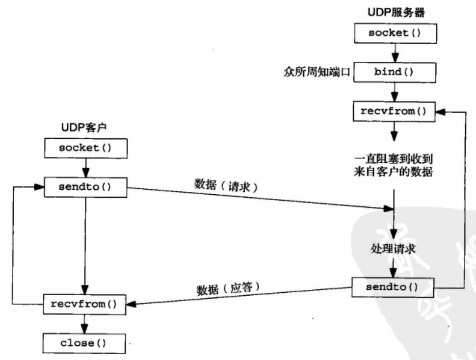

# UNIX网络编程 卷1：套接字联网API

这是一部传世之作！顶级网络编程专家Bill Fenner和Andrew M. Rudoff应邀执笔，对W. Richard Stevens的经典作品进行修订。书中吸纳了近几年网络技术的发展，增添了IPv6、SCTP协议和密钥管理套接字等内容，深入讨论了最新的关键标准、实现和技术。

- 作   者：W·Richard Stevens
- 全书源码：https://github.com/unpbook/unpv13e

??? 公共代码列表

    === "Makefile"

        ```makefile
        --8<-- "docs/unp-v1/Makefile"
        ```

    === ".clangd"
        配置clangd编译环境：

        ```yaml
        CompileFlags:
        Add:
          - "-I/home/cyub/read-notes/docs/unp-v1/src/include" #include进unp.h
        ```

    === "unp.h"

        ```c
        --8<-- "docs/unp-v1/src/include/unp.h"
        ```

    === "sock.c"

        ```c
        --8<-- "docs/unp-v1/src/lib/sock.c"
        ```

    === "stdio.c"

        ```c
        --8<-- "docs/unp-v1/src/lib/stdio.c"
        ```

    === "error.c"

        ```c
        --8<-- "docs/unp-v1/src/lib/error.c"
        ```
    
    === "unix.c"

        ```c
        --8<-- "docs/unp-v1/src/lib/unix.c"
        ```
    === "signal.c"

      ```c
      --8<-- "docs/unp-v1/src/lib/signal.c"
      ```


## Chap 8：基本UDP套接字编程

UDP是无连接不可靠的数据包协议。基于UDP协议的常见应用程序有：

- DNS(域名系统)
- NFS(网络文件系统)
- SNMP(简单网络管理协议)



### recvfrom 和 sendto 函数

```c
ssize_t recvfrom(int sockfd, void *buf, size_t len, int flags,
    struct sockaddr *src_addr, socklen_t *addrlen);

ssize_t sendto(int sockfd, const void *buf, size_t len, int flags,
    const struct sockaddr *dest_addr, socklen_t addrlen);
```

**每个UDP套接字都有一个接收缓冲区，并且这个缓冲区的大小是有限的**，到达该套接字的每个数据报都进入这个套接字接收缓冲区。当进程调用recvfrom时，缓冲区中的下一个数据报以FIFO（先入先出）顺序返回给进程。这样，在进程能够读该套接字中任何己排好队的数据报之前，如果有多个数据报到达该套接字，那么相继到达的数据报仅仅加到该套接字的接收缓冲区中。

如果recvfrom的from参数是一个空指针，那么相应的长度参数（addrlen）也必须是一个空指针，表示我们并不关心数据发送者的协议地址。但这样做存在一个风险：任何进程不论是在与本客户进程相同的主机上还是在不同的主机上，都可以向本客户的P地址和端口发送数据报，这些数据报将被客户该入并被认为是服务器的应答。

写一个长度为0的数据报是可行的。在UDP情况下，这会形成一个只包含一个IP首部（对于IPv4通常为20个字节，对于IPv6通常为40个字节）和一个8字节UDP首部而没有数据的IP数据报。这也意味着对于数据报协议，**recvfrom返回0值是可接受的：它并不像TCP套接字上read返回0值那样表示对端己关闭连接**。既然UDP是无连接的，因此也就没有诸如关闭一个UDP连接之类事情。

**对于一个UDP套接字，如果其进程首次调用sendto时它没有绑定一个本地端口，那么内核就在此时为它选择一个临时端口**。跟TCP一样，客户可以显式地调用bind，不过很少这样做。

**recvfrom调用，会永远阻塞直到获取到服务端的响应为止。而sendto调用不会阻塞，因为它先发送到缓存中**。

### UDP回射服务

=== "服务端"

    ```c title="udpserv01.c"
    --8<-- "docs/unp-v1/src/chap8/udpserv01.c"
    ```

=== "客户端"

    ```c title="udpcli01.c"
    --8<-- "docs/unp-v1/src/chap8/udpcli01.c"
    ```

  `udpcli01.c`代码中，由于没有校验服务端地址信息，可能会发生伪造的服务端器进行响应的情况。下面是一种优化处理：

  ```c title="校验是否是真实的服务端响应"
    --8<-- "docs/unp-v1/src/chap8/dgcliaddr.c"
  ```

但又带来一个问题。如果服务端是多IP的，由于`udpserv01.c`中`servaddr.sin_addr.s_addr = htonl(INADDR_ANY);`绑定的是任意IP的，可能服务器响应时候的出口IP并不是客户端请求指定的IP,那就回造成客户端误判为非法响应。

一个解决办法是：

1. 得到由recvfrom返回的IP地址后，客户通过在DNS中查找服务器主机的名字来验证该主机的域名（而不是它的IP地址）。
2. 另一个解决办法是：UDP服务器给服务器主机上配置的每个1P地址创建一个套接字，用bind捆绑每个IP地址到各自的套接字，然后在所有这些套接字上使用select（等待其中任何一个变得可读），再从可读的套接字给出应答。既然用于给出应答的套接字上绑定的IP地址就是客户请求的目的1P地址（否则该数据报不会被投递到该套接字），这就保证应答的源地址与请求的目的地址相同。

!!! note

    在多出口IP的Solaris系统上，服务器应答的源IP地址就是客户请求的目的IP地址，不会出现上述问题。上述讲述的情形针对源自Berkeley的实现，这些实现基于外出接口选择源IP地址.

### 服务端程序未运行时

当服务端程序`udpserv01`未运行时候，`udpcli01`中`Sendto`返回成功，然后`Recvfrom`尝试从服务端读取数据，但由于此时服务端未运行，所以一直会阻塞等待，此后如果再启动`udpserv01`，也无济于事，因为`udpserv01`逻辑是读到客户端请求数据后才会响应，而它错过了`udpcli01`调用`Sendto`数据的过程，最终`udpcli01`会永远死锁。

```shell
➜  unp-v1 git:(main) ✗ sudo tcpdump -n 'icmp[0] = 3' # 指定抓取端口不可达消息
tcpdump: data link type PKTAP
tcpdump: verbose output suppressed, use -v[v]... for full protocol decode
listening on pktap, link-type PKTAP (Apple DLT_PKTAP), snapshot length 524288 bytes
21:34:44.543511 IP 192.168.64.3 > 192.168.64.1: ICMP 192.168.64.3 udp port 6767 unreachable, length 42
```

另外可以通过`tcpdump`抓包可以看到，服务器端响应了`udp port 6767 unreachable`端口不可达的ICMP消息。这个ICMP错误是由`Sendto`引起的，它是异步错误(asynchronous error)。因为尽管`Sendto`发送成功了（实际上只是存放到IP数据报的缓冲空间成功了），但等到真正发送的时候，才发现端口不可达。

由于Recvfrom的sockfd是未连接的socket描述符，它是无法获取到ICMP回传过来的端口不可达消息。因为即使Recvfrom可以设置errno值，但考虑到Recvfrom中sockfd中无法获取到服务端地址和端口信息，所以就算设置了errno，然后获取到ICMP的端口不可达消息也没啥太大意义。

可能你会说在Recvfrom之前调用的Sendto时候会指定服务端的地址和端口，并且它俩是同一个sockfd，那么Recvfrom应该可以从sockfd关联信息中获取到对应服务端地址和端口，确实可以取到相关信息，但sockfd必须是已连接的sockfd（相关信息是通过connect记录的），否则sockfd中不会关联服务端地址和端口信息。

概括来说：**对于未连接的UDP连接，Recvfrom无法收到对端已关闭（未运行）的信息，只会一直阻塞等待**。

由于已连接的UDP socket只能与确定的对端交换数据报，所以 **已连接的UDP socket不能进行广播和多播**。

### 已连接的UDP套接字

已连接的UDP socket是通过调用调用connect实现的，它不会像TCP那样会进行三次握手，并且会检查是否存在立即可知的错误（比如一个显然不可达的目的地址），然后记录对端的IP地址和端口号。

```c
#include <sys/types.h>
#include <sys/socket.h>

int connect(int sockfd, const struct sockaddr *addr, socklen_t addrlen);
```

套接字类型 | write或send | 不指定目的地址的sendto | 指定目的地址的sendto
--- | --- | --- | ---
TCP套接字 | 可以 | 可以 | BISCONN
UDP套接字，已连接 | 可以 | 可以 | EISCONN
UDP套接字，未连接 | EDESTADDRREQ | EDESTADDRREQ | 可以

对应用程序在一个未连接的UDP套接字上调用sendto进行两次写入时候，内核会执行下面6个步骤：

- 连接套接字；
- 输出第一个数据报；
- 断开套接字连接：
- 连接套接字：
- 输出第二个数据报；
- 断开套接字连接。

而对于一个已连接的UDP套接字调用write时候，只需三步：

- 连接套接字；
- 输出第一个数据报；
- 输出第二个数据报；

可以看到 **已连接的UDP套接字性能明显高于未连接的UDP套接字**。

```c title="UDP客户端使用已连接的UDP"
// 通过make udpcli04 构建
--8<-- "docs/unp-v1/src/chap8/dgcliconnect.c"
```

## Chap20: 广播

### 概述

不同类型的寻址方式比较：

类型 | IPv4 | IPv6 | TCP | UDP | 所标识接口数  | 递送到接口数
--- | --- | --- | --- | --- | --- | --- 
单播（unicasting） | ✔️ | ✔️ | ✔️  | ✔️ | 一个 | 一个
任播（anycasting） | ✔️ | ✔️  | 尚没有 | ✔️ | 一组 | 一组中的一个
多播（multicasting） |可选 | ✔️ |  | ✔️ | 一组 | 一组中的全体
广播（broadcasting） | ✔️ | | | ✔️ | 全体 |全体

takeaway: 

- 多播支持在IPv4中是可选的，在IPv6中却是必需支持的
- IPv6不支持广播。使用广播的任何IPv4应用程序一旦移植到Pv6就必须改用多播重新编写
- 广播和多播要求用于UDP或原始IP，它们不能用于TCP。

广播的用途之一是在本地子网定位一个服务器主机，前提是已知或认定这个服务器主机位于本地子网，但是不知道它的单播IP地址。这种操作也称为 **资源发现（resource discovery）**，比如通过SSDP/mDNS等协议发现Iot设备。

另一个用途是在有多个客户主机与单个服务器主机通信的局域网环境中尽量减少分组流通。出于之个目的使用广播的因特网应用有多个例子。

- **ARP （Address Resolution Protocol，地址解析协议）**。ARP并不是一个用户应用，而是IPv4的基本组成部分之一。ARP在本地子网上广播一个请求说“IP地址为a.b.c.d的系统亮明身份，告诉我你的硬件地址”。ARP使用链路层广播而不是IP层广播。

- **DHCP（Dynamic Host Configration Protocol，动态主机配置协议）**。在认定本地子网上有一个DHCP服务器主机或中继主机的前提下，DHCP客户主机向广播地址（通常是
255.255.255.255，因为客户还不知道自己的IP地址、子网掩码以及本子网的受限广播地址）发送自己的请求。

- **NTP（Network Time Protocol，网络时间协议）**。NTP的一种常见使用情形是客户主机配置上待使用的一个或多个服务器主机的IP地址，然后以某个频率（每隔64秒钟或更长时
间一次）轮询这些服务器主机。根据由服务器返送的当前时间和到达服务器主机的RTT，客户使用精妙的算法更新本地时钟。然而在一个广播局域网上，服务器主机却可以为本地子网上的所有客户主机每隔64秒钟广播一次当前时间，免得每个客户主机各自轮询这个服务器主机，从而减少网络分组流通量。NTP协议以及NTP客户端的简单实现，可以参考笔者写的[demo](https://github.com/cyub/open/tree/main/ntp)。

??? "Ubuntu 如何开启 daytime 服务？"

    ```shell
    sudo apt-get install xinetd
    cd /etc/xinetd.d
    sudo vi daytime // 将配置中的disable设置为false
    sudo systemctl restart xinetd
    ```