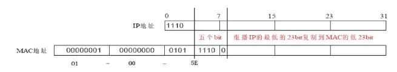

# UNIX网络编程 卷1：套接字联网API

这是一部传世之作！顶级网络编程专家Bill Fenner和Andrew M. Rudoff应邀执笔，对W. Richard Stevens的经典作品进行修订。书中吸纳了近几年网络技术的发展，增添了IPv6、SCTP协议和密钥管理套接字等内容，深入讨论了最新的关键标准、实现和技术。

- 作   者：W·Richard Stevens
- 全书源码：https://github.com/unpbook/unpv13e

??? 公共代码列表

    === "Makefile"

        ```makefile
        --8<-- "docs/unp-v1/Makefile"
        ```

    === ".clangd"
        配置clangd编译环境：

        ```yaml
        CompileFlags:
        Add:
          - "-I/home/cyub/read-notes/docs/unp-v1/src/include" #include进unp.h
        ```

    === "unp.h"

        ```c
        --8<-- "docs/unp-v1/src/include/unp.h"
        ```

    === "sock.c"

        ```c
        --8<-- "docs/unp-v1/src/lib/sock.c"
        ```

    === "stdio.c"

        ```c
        --8<-- "docs/unp-v1/src/lib/stdio.c"
        ```

    === "error.c"

        ```c
        --8<-- "docs/unp-v1/src/lib/error.c"
        ```
    
    === "unix.c"

        ```c
        --8<-- "docs/unp-v1/src/lib/unix.c"
        ```
    === "signal.c"

        ```c
        --8<-- "docs/unp-v1/src/lib/signal.c"
        ```


## Chap 8：基本UDP套接字编程

UDP是无连接不可靠的数据包协议。基于UDP协议的常见应用程序有：

- DNS(域名系统)
- NFS(网络文件系统)
- SNMP(简单网络管理协议)


### recvfrom 和 sendto 函数

```c
ssize_t recvfrom(int sockfd, void *buf, size_t len, int flags,
    struct sockaddr *src_addr, socklen_t *addrlen);

ssize_t sendto(int sockfd, const void *buf, size_t len, int flags,
    const struct sockaddr *dest_addr, socklen_t addrlen);
```

**每个UDP套接字都有一个接收缓冲区，并且这个缓冲区的大小是有限的**，到达该套接字的每个数据报都进入这个套接字接收缓冲区。当进程调用recvfrom时，缓冲区中的下一个数据报以FIFO（先入先出）顺序返回给进程。这样，在进程能够读该套接字中任何己排好队的数据报之前，如果有多个数据报到达该套接字，那么相继到达的数据报仅仅加到该套接字的接收缓冲区中。

如果recvfrom的from参数是一个空指针，那么相应的长度参数（addrlen）也必须是一个空指针，表示我们并不关心数据发送者的协议地址。但这样做存在一个风险：任何进程不论是在与本客户进程相同的主机上还是在不同的主机上，都可以向本客户的P地址和端口发送数据报，这些数据报将被客户该入并被认为是服务器的应答。

写一个长度为0的数据报是可行的。在UDP情况下，这会形成一个只包含一个IP首部（对于IPv4通常为20个字节，对于IPv6通常为40个字节）和一个8字节UDP首部而没有数据的IP数据报。这也意味着对于数据报协议，**recvfrom返回0值是可接受的：它并不像TCP套接字上read返回0值那样表示对端己关闭连接**。既然UDP是无连接的，因此也就没有诸如关闭一个UDP连接之类事情。

**对于一个UDP套接字，如果其进程首次调用sendto时它没有绑定一个本地端口，那么内核就在此时为它选择一个临时端口**。跟TCP一样，客户可以显式地调用bind，不过很少这样做。

**recvfrom调用，会永远阻塞直到获取到服务端的响应为止。而sendto调用不会阻塞，因为它先发送到缓存中**。

### UDP回射服务

=== "服务端"

    ```c title="udpserv01.c"
    --8<-- "docs/unp-v1/src/chap8/udpserv01.c"
    ```

=== "客户端"

    ```c title="udpcli01.c"
    --8<-- "docs/unp-v1/src/chap8/udpcli01.c"
    ```

  `udpcli01.c`代码中，由于没有校验服务端地址信息，可能会发生伪造的服务端器进行响应的情况。下面是一种优化处理：

  ```c title="校验是否是真实的服务端响应"
    --8<-- "docs/unp-v1/src/chap8/dgcliaddr.c"
  ```

但又带来一个问题。如果服务端是多IP的，由于`udpserv01.c`中`servaddr.sin_addr.s_addr = htonl(INADDR_ANY);`绑定的是任意IP的，可能服务器响应时候的出口IP并不是客户端请求指定的IP,那就回造成客户端误判为非法响应。

一个解决办法是：

1. 得到由recvfrom返回的IP地址后，客户通过在DNS中查找服务器主机的名字来验证该主机的域名（而不是它的IP地址）。
2. 另一个解决办法是：UDP服务器给服务器主机上配置的每个1P地址创建一个套接字，用bind捆绑每个IP地址到各自的套接字，然后在所有这些套接字上使用select（等待其中任何一个变得可读），再从可读的套接字给出应答。既然用于给出应答的套接字上绑定的IP地址就是客户请求的目的1P地址（否则该数据报不会被投递到该套接字），这就保证应答的源地址与请求的目的地址相同。

!!! note

    在多出口IP的Solaris系统上，服务器应答的源IP地址就是客户请求的目的IP地址，不会出现上述问题。上述讲述的情形针对源自Berkeley的实现，这些实现基于外出接口选择源IP地址.

### 服务端程序未运行时

当服务端程序`udpserv01`未运行时候，`udpcli01`中`Sendto`返回成功，然后`Recvfrom`尝试从服务端读取数据，但由于此时服务端未运行，所以一直会阻塞等待，此后如果再启动`udpserv01`，也无济于事，因为`udpserv01`逻辑是读到客户端请求数据后才会响应，而它错过了`udpcli01`调用`Sendto`数据的过程，最终`udpcli01`会永远死锁。

```shell
➜  unp-v1 git:(main) ✗ sudo tcpdump -n 'icmp[0] = 3' # 指定抓取端口不可达消息
tcpdump: data link type PKTAP
tcpdump: verbose output suppressed, use -v[v]... for full protocol decode
listening on pktap, link-type PKTAP (Apple DLT_PKTAP), snapshot length 524288 bytes
21:34:44.543511 IP 192.168.64.3 > 192.168.64.1: ICMP 192.168.64.3 udp port 6767 unreachable, length 42
```

另外可以通过`tcpdump`抓包可以看到，服务器端响应了`udp port 6767 unreachable`端口不可达的ICMP消息。这个ICMP错误是由`Sendto`引起的，它是异步错误(asynchronous error)。因为尽管`Sendto`发送成功了（实际上只是存放到IP数据报的缓冲空间成功了），但等到真正发送的时候，才发现端口不可达。

由于Recvfrom的sockfd是未连接的socket描述符，它是无法获取到ICMP回传过来的端口不可达消息。因为即使Recvfrom可以设置errno值，但考虑到Recvfrom中sockfd中无法获取到服务端地址和端口信息，所以就算设置了errno，然后获取到ICMP的端口不可达消息也没啥太大意义。

可能你会说在Recvfrom之前调用的Sendto时候会指定服务端的地址和端口，并且它俩是同一个sockfd，那么Recvfrom应该可以从sockfd关联信息中获取到对应服务端地址和端口，确实可以取到相关信息，但sockfd必须是已连接的sockfd（相关信息是通过connect记录的），否则sockfd中不会关联服务端地址和端口信息。

概括来说：**对于未连接的UDP连接，Recvfrom无法收到对端已关闭（未运行）的信息，只会一直阻塞等待**。

由于已连接的UDP socket只能与确定的对端交换数据报，所以 **已连接的UDP socket不能进行广播和多播**。

### 已连接的UDP套接字

已连接的UDP socket是通过调用调用connect实现的，它不会像TCP那样会进行三次握手，并且会检查是否存在立即可知的错误（比如一个显然不可达的目的地址），然后记录对端的IP地址和端口号。

```c
#include <sys/types.h>
#include <sys/socket.h>

int connect(int sockfd, const struct sockaddr *addr, socklen_t addrlen);
```

套接字类型 | write或send | 不指定目的地址的sendto | 指定目的地址的sendto
--- | --- | --- | ---
TCP套接字 | 可以 | 可以 | BISCONN
UDP套接字，已连接 | 可以 | 可以 | EISCONN
UDP套接字，未连接 | EDESTADDRREQ | EDESTADDRREQ | 可以

对应用程序在一个未连接的UDP套接字上调用sendto进行两次写入时候，内核会执行下面6个步骤：

- 连接套接字；
- 输出第一个数据报；
- 断开套接字连接：
- 连接套接字：
- 输出第二个数据报；
- 断开套接字连接。

而对于一个已连接的UDP套接字调用write时候，只需三步：

- 连接套接字；
- 输出第一个数据报；
- 输出第二个数据报；

可以看到 **已连接的UDP套接字性能明显高于未连接的UDP套接字**。

```c title="UDP客户端使用已连接的UDP"
// 通过make udpcli04 构建
--8<-- "docs/unp-v1/src/chap8/dgcliconnect.c"
```

## Chap20: 广播

### 概述

不同类型的寻址方式比较：

类型 | IPv4 | IPv6 | TCP | UDP | 所标识接口数  | 递送到接口数
--- | --- | --- | --- | --- | --- | --- 
单播（unicasting） | ✔️ | ✔️ | ✔️  | ✔️ | 一个 | 一个
任播（anycasting） | ✔️ | ✔️  | 尚没有 | ✔️ | 一组 | 一组中的一个
多播（multicasting） |可选 | ✔️ |  | ✔️ | 一组 | 一组中的全体
广播（broadcasting） | ✔️ | | | ✔️ | 全体 |全体

takeaway: 

- 多播支持在IPv4中是可选的，在IPv6中却是必需支持的
- IPv6不支持广播。使用广播的任何IPv4应用程序一旦移植到Pv6就必须改用多播重新编写
- 广播和多播要求用于UDP或原始IP，它们不能用于TCP。

广播的用途之一是在本地子网定位一个服务器主机，前提是已知或认定这个服务器主机位于本地子网，但是不知道它的单播IP地址。这种操作也称为 **资源发现（resource discovery）**，比如通过SSDP/mDNS等协议发现Iot设备。

另一个用途是在有多个客户主机与单个服务器主机通信的局域网环境中尽量减少分组流通。出于之个目的使用广播的因特网应用有多个例子。

- **ARP （Address Resolution Protocol，地址解析协议）**。ARP并不是一个用户应用，而是IPv4的基本组成部分之一。ARP在本地子网上广播一个请求说“IP地址为a.b.c.d的系统亮明身份，告诉我你的硬件地址”。ARP使用链路层广播而不是IP层广播。

- **DHCP（Dynamic Host Configration Protocol，动态主机配置协议）**。在认定本地子网上有一个DHCP服务器主机或中继主机的前提下，DHCP客户主机向广播地址（通常是
255.255.255.255，因为客户还不知道自己的IP地址、子网掩码以及本子网的受限广播地址）发送自己的请求。

- **NTP（Network Time Protocol，网络时间协议）**。NTP的一种常见使用情形是客户主机配置上待使用的一个或多个服务器主机的IP地址，然后以某个频率（每隔64秒钟或更长时
间一次）轮询这些服务器主机。根据由服务器返送的当前时间和到达服务器主机的RTT，客户使用精妙的算法更新本地时钟。然而在一个广播局域网上，服务器主机却可以为本地子网上的所有客户主机每隔64秒钟广播一次当前时间，免得每个客户主机各自轮询这个服务器主机，从而减少网络分组流通量。NTP协议以及NTP客户端的简单实现，可以参考笔者写的[demo](https://github.com/cyub/open/tree/main/ntp)。

??? "Ubuntu 如何开启 daytime 服务？"

    ```shell
    sudo apt-get install xinetd
    cd /etc/xinetd.d
    sudo vi daytime // 将配置中的disable设置为false
    sudo systemctl restart xinetd
    ```

## Chap21: 多播

多播（Multicast），也称为组播，它是一种网络传输方式，允许一个发送者（源）同时向多个接收者（接收组）发送数据。这种技术在需要将相同的数据发送给多个接收者时非常有用，可以减少网络流量和发送者的负担。多播数据通过多播路由协议（如PIM-SM、DVMRP等）在网络中传播。这些协议负责在网络中建立多播分发树，其中IGMP（Internet Group Management Protocol）用于管理多播组成员资格的协议，允许设备加入或离开多播组。

### 多播地址

IP地址分类：

```
   Bit -->  0                           31            Address Range:
           +-+----------------------------+
           |0|       Class A Address      |       0.0.0.0 - 127.255.255.255
           +-+----------------------------+
           +-+-+--------------------------+
           |1 0|     Class B Address      |     128.0.0.0 - 191.255.255.255
           +-+-+--------------------------+
           +-+-+-+------------------------+
           |1 1 0|   Class C Address      |     192.0.0.0 - 223.255.255.255
           +-+-+-+------------------------+
           +-+-+-+-+----------------------+
           |1 1 1 0|  MULTICAST Address   |     224.0.0.0 - 239.255.255.255
           +-+-+-+-+----------------------+
           +-+-+-+-+-+--------------------+
           |1 1 1 1 0|     Reserved       |     240.0.0.0 - 247.255.255.255
           +-+-+-+-+-+--------------------+
```

IPv4的D类地址（从224.0.0.0到239.255.255.255）是IPv4多播地址。D类地址的低序28位构成多播组ID（group ID），整个32位地址则称为组地址（group address）。

特殊的IPV4多播地址：

- **224.0.0.1是所有主机（al-hosts）组**。子网上所有具有多播能力的节点（主机、路由器或打印机等）必须在所有具有多播能力的接口上加入该组。（我们不久将讨论到加入一个
多播组意味着什么。）
- **224.0.0.2是所有路由器（all-routers）组**。子网上所有多播路由器必须在所有具有多播能力的接口上加入该组。

介于224.0.0.0到224.0.0.255之间的地址（也可以写成224.0.0.0/24）称为链路局部的 （link local）多播地址。这些地址是为低级拓扑发现和维护协议保留的。多播路由器从不转发以这些地址为目的地址的数据报。

#### 多播地址和MAC地址的关系



多播MAC地址的高24bit位是以01-00-5E开头，低23bit为多播IP地址的低23bit。由于IP多播地址的高4bit是1110，标识了多播组，而低28bit中只有23bit被映像到多播MAC地址上，这样IP多播地址中就会有5bit没有使用，从而出现了32个IP多播地址映像到同一MAC地址上的结果。

### 多播流程

1. 接收方的应用进程创建一个UDP套接字，捆绑端口一个固定端口（这里假定是1900）到该套接字上，然后加入（joining）一个多播组（这个假定是224.0.1.1）。加入多播组操作是通过调用setsockopt完成，IPv4层内部负责保存这些信息。
2. 发送方的应用进程创建一个UDP套接字，往IP地址224.0.1.1的1900端口发送一个数据报。**发送多播数据报无需任何特殊处理；发送应用进程不必为此加入多播组**。
3. 接收方收到多播请求之后，接收方的数据链路层，会过滤掉不是多播的帧，接着传递到IP层，IP层会比较多播的IP地址和本机接收方程序已加入的所有多播地址，来决定是否丢弃。若是接收方程序加入的多播地址，则接入传递到UDP层，UDP层判断端口是不是接收方绑定的1900端口，若不是则丢弃。

### 多播套接字选项

选项名 | 数据类型 | 说明
--- | --- | ---
**组成员无关的套接字选项：**
IP_MULTICAST_IF | struct in_addr | 指定外出多播数据报的默认接口
IP_MULTICASTTIL | u_char | 指定外出多播数据报的TTL
IP_MULTICASTLOOP | u_char | 开启或禁止外出多播数据报的回馈
|
IPV6_MULTICAST_TF | u_int | 指定外出多播数据报的默认接口
TPV6_MULTICAST_HOPS | int | 指定外出多播数据报的跳限
IPV6_MULTICAST_LOOP | u_int | 开启或禁止外出多播数据报的回馈
**组成员相关的套接字选项:**
IP_ADD_MEMBERSHIP | struct ip_mreq | 加入一个多播组
IP_DROP_MEMBERSHIP | struct ip_mreq | 离开一个多播组
IP_BLOCK_SOURCE | struct ip_mreg_source | 在一个已加入组上阻塞某个源
IP_UNBLOCK_SOURCE | struct ip_mreg_source | 开通一个早先阻塞的源
IP_ADD_SOURCE_MEMBERSHIP | struct ip_mreg_source | 加入一个源特定多播组
IP_DROP_SOURCE_MEMBERSHIP | struct ip_mreg_source | 离开一个源特定多播组
|
TPV6_JOIN_GROUP | struct ipv6_mreq | 加入一个多播组
IPV6_LEAVE_GROUP | struct ipv6_mreq | 离开一个多播组
|
MCAST_JOIN_GROUP | struct group_req | 加入一个多播组
MCAST_LEAVE_GROUP | struct group_req | 离开—一个多播组
MCAST_BLOCK_SOURCE | struct group_source_req | 在一个已加入组上阻塞某个源
MCAST_UNBLOCKSOURCE | struct group_source_req | 开通一个早先阻塞的源
MCAST_JOIN_SOURCE_GROUP | struct group_source_req | 加入一个源特定多播组
MCAST_LEAVE_SOURCE_GROUP | struct group_source_req | 离开一个源特定多播组


1. IP_ADD_MEMBERSHIP、IPV6_JOIN_GROUP 和 MCAST_JOIN_GROUP

    该三个选项用于加入不限源的多播组，其对应的数据结构体如下：

    ```c
    // IP_ADD_MEMBERSHIP IPv4版本
    struct ip_mreq {
        struct  in_addr imr_multiaddr;  /* IP multicast address of group */
        struct  in_addr imr_interface;  /* local IP address of interface */
    };

    // IPV6_JOIN_GROUP IPV6版本
    struct ipv6_mreq {
        struct in6_addr ipv6mr_multiaddr;
        unsigned int    ipv6mr_interface;
    };

    // MCAST_JOIN_GROUP IP协议无关的版本
    struct group_req {
        uint32_t                gr_interface;   /* interface index */
        struct sockaddr_storage gr_group;       /* group address */
    };
    ```

    如果ip_mreq的imr_interface指定为INADDR_ANY，或ipv6_mreq的ipv6mr_interface指定为0，或group_req的gr_interface指定为0时候，表明未指定本地接口，那么会由内核选择一个本地接口。

    在一个给定套接字上可以多次加入多播组，不过每次加入的必须是不同的多播地址，或者是在不同接口上的同一个多播地址。多次加入可用于多宿主机，例如创建一个套接字后，对于一个给定的多播地址在每个接口上执行一次加入。

2. IP_DROP_MEMBERSHIP、IPV6_LEAVE_GROUP 和 MCAST_LEAVE_GROUP

    该三个选项用于离开不限源的多播组。如果未指定本地接口，那么离开第一个匹配的多播组。所用到的数据结构与加入多播组是一样的。

    如果一个进程加入某个多播组后从不显式离开该组，那么当相应套接字关闭时（因显式地关闭，或因进程终止），该成员关系也自动地抹除。单个主机上可能有多个套接字各自加入相同的多播组，这种情况下，单个套接字上成员关系的抹除不影响该主机继续作为该多播组的成员，直到最后一个套接字也离开该多播组。

3. IP_BLOCK_SOURCE 和 MCAST_BLOCK_SOURCE

    用于阻塞来自某个源的多播分组。相关数据结构有：

    ```c
    struct ip_mreq_source {
        struct  in_addr imr_multiaddr;  /* IP multicast address of group */
        struct  in_addr imr_sourceaddr; /* IP address of source */
        struct  in_addr imr_interface;  /* local IP address of interface */
    };

    struct group_source_req {
        uint32_t                gsr_interface;  /* interface index */
        struct sockaddr_storage gsr_group;      /* group address */
        struct sockaddr_storage gsr_source;     /* source address */
    };
    ```

    如果本地接口指定为IPv4的通配地址（INADDR_ANY）或与协议无关的API的0值索引，那就由内核选择与首个匹配的多播组成员关系对应的本地接口。

    源阻塞请求修改已存在的组成员关系，因此必须己经使用 IPADD_ MEMBERSHIE、IFV6_JOIN_GROUP或MCAST_JOIN_GROUP在对应的接口上加入对应的多播组。

4. IP_UNBLOCK_SOURCE 和 MCAST_UNBLOCK_SOURCE

    解除阻塞源。所使用到的数据结构通设置阻塞时候的一样。如果末指定本地接口（也就是说对于IPv4其值为INADDR_ANY，对于与协议无关的API为0值索引），那么开通首个匹配的被阻塞源。

5. IP_ADD_SOURCE_MEMBERSHIP 和 MCAST_JOIN_SOURCE_GROUP

    在一个指定的本地接口上加入一个特定于源的多播组。加入之前或者加入之后，都不能使用IP_ADD_MEMBERSHIP、IPV6_JOIN_GROUP、MCAST_JOIN_GROUP加入这个多播组。

    如果本地接口指定为1Pv4的通配地（INADDRANY）或与协议无关的API的0值索引，那就由内核选择一个本地接口。

6. IP_DROP_SOURCE_MEMBERSHIP 和 MCAST_LEAVE_SOURCE_GROUP

    用于在一个指定的本地接口离开一个特定于源的多播组。细节同不限源的多播组离开相同。

7. IP_MULTICAST_IF 和 IPV6_MULTICAST_IF

    指定通过本套接字发送的多播数据报的外出接口。对于IPv4版本，该接口由某个in_addr结构指定：对于IPPv6，该接口由某个接口索引指定。如果其值对于IPv4为 INADDR_ANY，对于IPv6为0值接口索引，那么先前通过本套接字选项指派的任何接口将被抹除，系统改为每次发送数据报都选择外出接口。

    注意仔细区分当进程加入多播组时指定的（或由内核选定的）本地接口，它是用来决定是通过那个接口接收数据。而这个是当进程发送多播数据报时指定的（或由内核选定的）本地接口。

8. IP_MULTICAST_TTL 和 IPV6_MULTICAST_HOPS

    给外出的多播数据报设置1Pv4的TTL或IPv6的跳限。如果不指定，这两个版本就都默认为1，从而把多播数据报限制在本地子网。

9. IP_MULTICAST_LOOP 和 IPV6_MULTICAST_LOOP

    开启或禁止多播数据报的本地自环（即回馈）。默认情况下回馈开启：如果一个主机在某个外出接口上属于某个多播组，那么该主机上由某个进程发送的目的地为该多播组的每个数据报都有一个副本回馈，被该主机作为一个收取的数据报处理。

    类似广播的是，一个主机上发送的任何广播数据报也被该主机作为收取的数据报处理，但对于广播而言，这种回馈无法禁止。这一点意味着如果一个进程同时局于所发送数据报的目的多播组，它就会收到自己发送的任何数据报。

#### IP_ADD_MEMBERSHIP/IP_DROP_MEMBERSHIP 是如何工作的？

当谈论IP_ADD_MEMBERSHIP和IP_DROP_MEMBERSHIP时，我们说过内核使用这个“命令”提供的信息来选择接受或丢弃哪些多播数据报。这是事实，但并非全部事实。这种简化意味着我们的主机将接收世界各地所有多播组的多播数据报，然后它将检查其上运行的进程发出的成员资格，以决定是将流量传递给它们还是将其丢弃。正如你可以想象的那样，这完全是带宽浪费。

实际发生的情况是，主机指示其路由器告诉它们对哪些多播组感兴趣；然后，这些路由器告诉它们的上游路由器它们想要接收该流量，等等。用于决定何时请求某个群组的流量或表示不再需要该流量的算法有很大差异。然而，有一点永远不会改变：信息的传输方式。 IGMP 就是用于此目的。它代表互联网组管理协议。它是一个新协议，在许多方面与ICMP类似，协议号为2，其消息以IP数据报形式承载，并且要求所有符合2级的主机都实现该协议。

**IGMP（Internet Group Management Protocol，互联网组管理协议）是允许多个设备共享一个 IP 地址以便它们可以接收相同数据的协议**。**IGMP 是一个网络层协议**，用于在使用互联网协议版本 4 (IPv4) 的网络上设置多播。具体来说，IGMP 允许设备加入一个多播组。IGMP的工作机制确保了多播流量的有效管理和分发，减少了不必要的网络流量和潜在的拥塞。

IGMP定义了几个主要的消息类型，包括：

- IGMP查询：路由器定期发送IGMP查询报文，以发现哪些组仍然有活跃的成员。

    通用查询报文的目标IP为224.0.0.1（所有主机），IGMP报头内的组播IP为0.0.0.0。用来查询该网段有哪些组播组的成员。特定组查询报文的目标IP则是要查询的组播组地址。
- IGMP报告：主机收到查询后，如果它希望继续接收多播流量，就会发送IGMP报告报文来响应查询。

    该报文由主机发出。可对组播路由器发出的查询报文进行回应，同时主机在主动加入特定组的时候，也会主动发送该报文报告。报告报文的目标IP和IGMP报头内的组播IP均为主机加入的组播组地址，注意是虽然回应路由器的，但数据包的IP地址是组播组地址。

- IGMP离开组：如果主机不再希望接收特定多播组的流量，它可以发送IGMP离开组报文来通知路由器。

IGMP目前有三个版本，目前用的最多的是IGMPv2。IGMPv1主要基于查询和响应机制来完成对组播组成员的管理；IGMPv2增加了查询器选举机制和离开组机制；IGMPv3在兼容和继承IGMPv1和IGMPv2的基础上，进一步增强了主机的控制能力，并增强了查询和报告报文的功能。

#### 什么是 IGMP 侦听？

IGMP 是网络层协议，只有知道网络层的网络设备才能收发消息。路由器在网络层运行，而网络交换机可能只知道第 2 层，也称为数据链路层。结果，交换机可能不知道哪些网络设备是多播组的一部分，而哪些不是。它最终可能会将多播流量转发到不需要它的设备，这会占用网络带宽和设备处理能力，从而减慢整个网络的速度。

IGMP 侦听通过启用交换机对 IGMP 消息的“侦听”来解决此问题。通常，第 2 层交换机不知道 IGMP 消息，但它们可以通过 IGMP 侦听来侦听这些消息。这使它们能够确定应该将多播消息转发到哪里，以便只有正确的设备才会收到多播流量。

#### IP多播中的隧道技术

当IP多播分组在传输过程中遇到有不支持多播协议的路由器或网络时，就要采用 **隧道(tunneling)技术**。

IP多播隧道的工作原理：

1. 网络1的主机向网络2中的一些主机进行多播。但是，路由器1或路由器2不支持多播协议，因而不能按多播地址转发多播分组。因此，路由器1就必须对多播分组进行再次封装，加上普通IP分组头，使它成为向单一目的站发送的单播分组，然后通过"隧道"从路由器1发送到路由器2。

2. 单播分组到达路由器2后，再由路由器2除去其普通IP分组头，使它又恢复成原来的多播分组，继续向多个目的站转发。

这种使用隧道技术传送IP分组的方法称为"IP中IP分组"(IP-in-IP)。

??? "一个简单的多播服务端和客户端的示例："

    === "simple_multicastserver.c"

        ```c
        --8<-- "docs/unp-v1/src/chap21/simple_multicastserver.c"
        ```

    === "simple_multicastcli.c"

        ```c
        --8<-- "docs/unp-v1/src/chap21/simple_multicastcli.c"
        ```

## 参考资料

- [Multicast over TCP/IP HOWTO](https://tldp.org/HOWTO/Multicast-HOWTO.html)